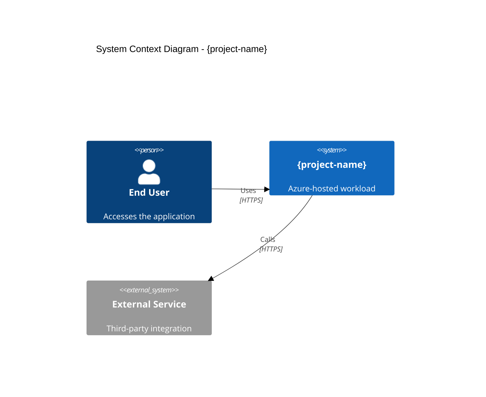
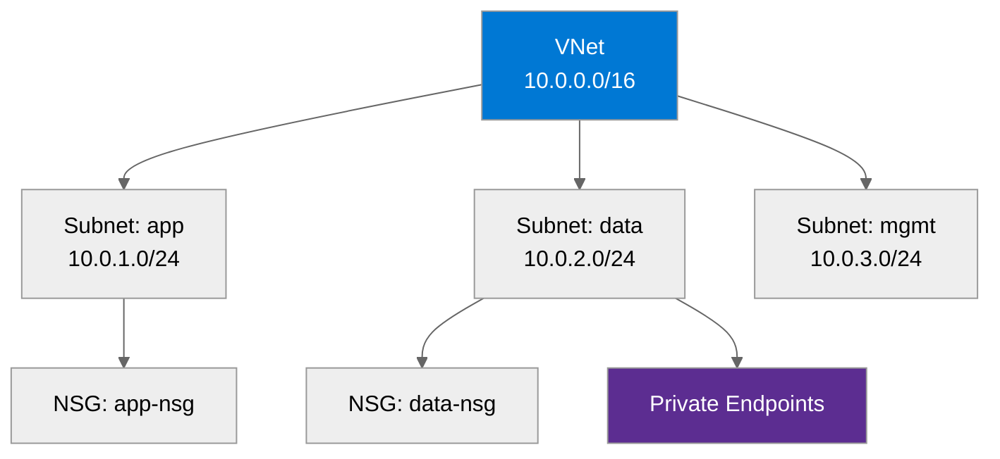

# Azure Design Document: {project-name}

<strong>📑 Table of Contents</strong>

- [1. Introduction](#1-introduction)
- [2. Azure Architecture Overview](#2-azure-architecture-overview)
- [3. Networking](#3-networking)
- [4. Storage](#4-storage)
- [5. Compute](#5-compute)
- [6. Identity & Access](#6-identity--access)
- [7. Security & Compliance](#7-security--compliance)
- [8. Backup & Disaster Recovery](#8-backup--disaster-recovery)
- [9. Management & Monitoring](#9-management--monitoring)
- [10. Appendix](#10-appendix)
- [References](#references)

> Generated by {agent} agent | {date}

| ⬅️ Previous | 📑 Index | Next ➡️ |
| --- | --- | --- |
| [07-documentation-index.md](07-documentation-index.md) | [README](README.md) | [07-operations-runbook.md](07-operations-runbook.md) |

**Version**: 1.0
**Date**: {date}
**Author**: Generated by Workload Documentation Generator
**Status**: Draft

---

## 1. Introduction

### 1.1 Document Purpose

This design document provides comprehensive technical documentation for the {project-name}
Azure infrastructure. It serves as a reference for operations teams, auditors, and future
development efforts.

**Intended Audience:**

- Solution Architects
- Operations/SRE Teams
- Security & Compliance Teams
- Development Teams

### 1.2 Project Overview

{project-description}

**Business Objectives:**

- {objective-1}
- {objective-2}
- {objective-3}

### 1.3 Design Objectives

| Objective    | Target   | Implementation   |
| ------------ | -------- | ---------------- |
| Availability | {target} | {implementation} |
| Performance  | {target} | {implementation} |
| Security     | {target} | {implementation} |
| Scalability  | {target} | {implementation} |

### 1.4 Constraints & Assumptions

**Constraints:**

- {constraint-1}
- {constraint-2}

**Assumptions:**

- {assumption-1}
- {assumption-2}

### 1.5 Stakeholders

| Role   | Team   | Responsibility   |
| ------ | ------ | ---------------- |
| {role} | {team} | {responsibility} |

---

## 2. Azure Architecture Overview

### 2.1 Architecture Diagram

> Replace with actual C4 context or deployment diagram for the project.

### 2.2 Resource Summary

| Category   | Count |
| ---------- | ----- |
| Compute    | {n}   |
| Networking | {n}   |
| Data       | {n}   |
| Security   | {n}   |

---

## 3. Networking

> Replace with actual network topology.

{networking-details}

---

## 4. Storage

{storage-details}

---

## 5. Compute

{compute-details}

---

## 6. Identity & Access

{identity-details}

---

## 7. Security & Compliance

<strong>🔒 Security Controls</strong>

| Control | Implementation | Evidence |
| ------- | -------------- | -------- |
| TLS 1.2+ | {implementation} | {evidence link} |
| HTTPS-only | {implementation} | {evidence link} |
| Managed Identity | {implementation} | {evidence link} |
| Network isolation | {implementation} | {evidence link} |

<strong>📋 Compliance Mapping</strong>

| Framework | Control ID | Status |
| --------- | ---------- | ------ |
| {framework} | {control} | ✅ / ⚠️ / ❌ |

{security-details}

---

## 8. Backup & Disaster Recovery

{backup-dr-details}

---

## 9. Management & Monitoring

{monitoring-details}

---

## 10. Appendix

📋 Detailed Resource Configuration

{appendix-content}

📚 Reference Architecture Links

| Architecture | Link |
| ------------ | ---- |
| {reference-name} | {url} |

---

## References

> [!NOTE]
> 📚 The following Microsoft Learn resources provide additional guidance.

| Topic                      | Link                                                                                               |
| -------------------------- | -------------------------------------------------------------------------------------------------- |
| Well-Architected Framework | [Overview](https://learn.microsoft.com/azure/well-architected/)                                    |
| Azure Architecture Center  | [Architectures](https://learn.microsoft.com/azure/architecture/)                                   |
| Security Best Practices    | [Security Baseline](https://learn.microsoft.com/security/benchmark/azure/overview)                 |
| Networking Best Practices  | [Network Security](https://learn.microsoft.com/azure/security/fundamentals/network-best-practices) |
| Backup Best Practices      | [Azure Backup](https://learn.microsoft.com/azure/backup/backup-best-practices)                     |
| Monitoring Overview        | [Azure Monitor](https://learn.microsoft.com/azure/azure-monitor/overview)                          |

---

_Design document generated from infrastructure artifacts._

---

| ⬅️ [07-documentation-index.md](07-documentation-index.md) | 🏠 [Project Index](README.md) | ➡️ [07-operations-runbook.md](07-operations-runbook.md) |
| --- | --- | --- |
