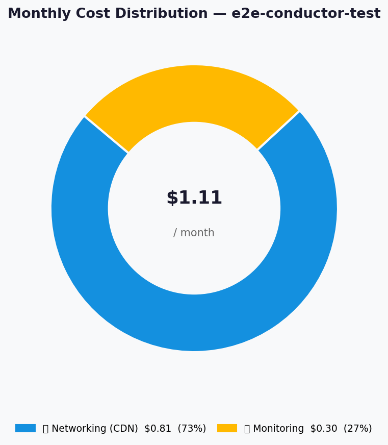
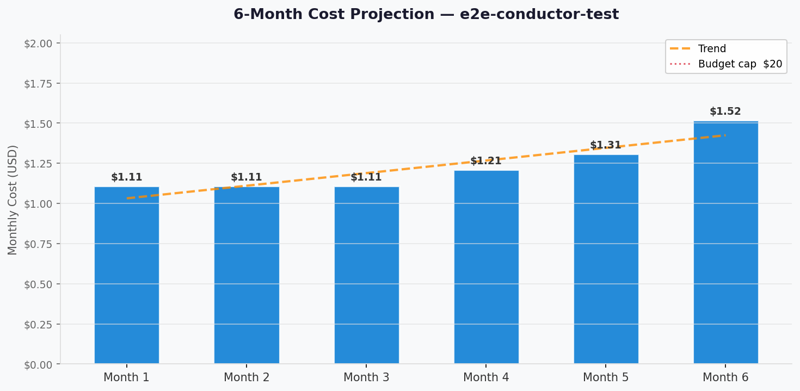

# 💰 Azure Cost Estimate: e2e-conductor-test


<details open>
<summary><strong>📑 Cost Estimate Contents</strong></summary>

- [💵 Cost At-a-Glance](#-cost-at-a-glance)
- [✅ Decision Summary](#-decision-summary)
- [🔁 Requirements → Cost Mapping](#-requirements--cost-mapping)
- [📊 Top 5 Cost Drivers](#-top-5-cost-drivers)
- [🏛️ Architecture Overview](#-architecture-overview)
- [🧾 What We Are Not Paying For (Yet)](#-what-we-are-not-paying-for-yet)
- [⚠️ Cost Risk Indicators](#-cost-risk-indicators)
- [🎯 Quick Decision Matrix](#-quick-decision-matrix)
- [💰 Savings Opportunities](#-savings-opportunities)
- [🧾 Detailed Cost Breakdown](#-detailed-cost-breakdown)
- [References](#references)

</details>

> Generated by architect agent | 2026-03-09

| ⬅️ Previous                                                    | 📑 Index            | Next ➡️                                                      |
| -------------------------------------------------------------- | ------------------- | ------------------------------------------------------------ |
| [02-architecture-assessment.md](02-architecture-assessment.md) | [README](README.md) | [04-governance-constraints.md](04-governance-constraints.md) |

**Generated**: 2026-03-09
**Region**: westeurope
**Environment**: Development
**MCP Tools Used**: azure_bulk_estimate, azure_price_search, azure_price_compare
**Architecture Reference**: [02-architecture-assessment.md](02-architecture-assessment.md)

## 💵 Cost At-a-Glance

> **Monthly Total: ~$1.11** | Annual: ~$13.32
>
> ```text
> Budget: $20/month (soft) | Utilization: 6% ($1.11 of $20)
> ```
>
> | Status            | Indicator                                 |
> | ----------------- | ----------------------------------------- |
> | Cost Trend        | ➡️ Stable                                 |
> | Savings Available | 💰 Minimal — already on free/lowest tiers |
> | Compliance        | ✅ None required (test workload)          |

## ✅ Decision Summary

- ✅ Approved: Azure Static Web App (Free), Azure CDN Standard, Log Analytics (Free tier), Metric Alert
- ⏳ Deferred: Custom domain, Application Insights, WAF/Front Door, Standard SWA tier
- 🔁 Redesign Trigger: Moving to production traffic (>100 GB/month CDN egress) or requiring server-side APIs forces a tier upgrade

**Confidence**: Medium | **Expected Variance**: ±20% (CDN cost is usage-driven; actual data transfer may differ from the 10 GB/month estimate)

## 🔁 Requirements → Cost Mapping

| Requirement                | Architecture Decision                | Cost Impact | Mandatory |
| -------------------------- | ------------------------------------ | ----------- | --------- |
| SLA 99.9%, RTO 4h, RPO 24h | SWA Free + CDN Standard (99.95% SLA) | +$0.81/mo   | Yes       |
| No compliance requirements | No WAF, no private endpoints         | $0 savings  | Yes       |
| Budget ~$20/month          | Free tiers where possible            | $1.11/mo    | Yes       |
| HTTPS enforcement          | Managed SSL via SWA (included)       | $0          | Yes       |
| CDN health monitoring      | Azure Monitor metric alert           | +$0.30/mo   | No        |
| GitHub Actions CI/CD       | Built-in SWA integration             | $0          | Yes       |

## 📊 Top 5 Cost Drivers

| Rank | Resource                  | Monthly Cost | % of Total | Trend | Optimization          |
| ---- | ------------------------- | ------------ | ---------- | ----- | --------------------- |
| 1️⃣   | Azure CDN Standard        | $0.81        | 73%        | ↗️    | Monitor egress volume |
| 2️⃣   | Azure Monitor Alert       | $0.30        | 27%        | ➡️    | None needed           |
| 3️⃣   | Azure Static Web App Free | $0.00        | 0%         | ➡️    | Stay on Free tier     |
| 4️⃣   | Log Analytics Free        | $0.00        | 0%         | ➡️    | Stay under 5 GB/mo    |
| 5️⃣   | Action Group (email)      | $0.00        | 0%         | ➡️    | None needed           |

> 💡 **Quick Win**: CDN cost is the only variable — keep static assets well-cached (high cache-hit ratio) to minimize origin egress.

<details>
<summary><strong>Cost Driver Details</strong></summary>

#### 1️⃣ Azure CDN Standard

| Aspect            | Detail                                                          |
| ----------------- | --------------------------------------------------------------- |
| Current SKU       | Standard Microsoft                                              |
| Monthly Cost      | $0.81                                                           |
| Cost Breakdown    | Egress: ~10 GB × $0.081/GB = $0.81                              |
| Optimization      | Optimize cache-control headers to maximize CDN edge hits        |
| Potential Savings | Negligible at current volume; cost scales linearly with traffic |

#### 2️⃣ Azure Monitor Alert

| Aspect            | Detail                                    |
| ----------------- | ----------------------------------------- |
| Current SKU       | Metric alert (1 rule)                     |
| Monthly Cost      | $0.30                                     |
| Optimization      | Could remove if alerting is not required  |
| Potential Savings | $0.30/month ($3.60/year) if alert removed |

</details>

## 🏛️ Architecture Overview

### Cost Distribution

| Category         | Monthly Cost (USD) | Share |
| ---------------- | -----------------: | ----: |
| 🌐 Networking    |              $0.81 |   73% |
| 📊 Monitoring    |              $0.30 |   27% |
| 💻 Compute       |              $0.00 |    0% |
| 💾 Data Services |              $0.00 |    0% |



### Month-over-Month Projection



> Projection assumes stable traffic at ~10 GB/month CDN egress for months 1-3,
> growing to ~15 GB by month 6 as test usage expands.

### Key Design Decisions Affecting Cost

| Decision             | Cost Impact | Business Rationale                      | Status   |
| -------------------- | ----------- | --------------------------------------- | -------- |
| SWA Free tier        | $0/month    | Sufficient for test/demo workload       | Required |
| CDN Standard (vs FD) | -$25+/month | Front Door unnecessary for static tests | Required |
| No App Insights      | -$0/month   | Low volume; enable later if needed      | Optional |

## 🧾 What We Are Not Paying For (Yet)

- **Azure Front Door Premium**: Would add WAF + private link (~$35+/month); not needed for public test content
- **Static Web App Standard tier**: Adds custom auth, staging slots ($9/month); not needed for current scope
- **Application Insights**: Detailed APM telemetry (~$2-5/month at low volume); enable if debugging needed
- **DDoS Protection Standard**: ~$2,944/month; completely unjustified for test workload
- **Custom domain + DNS zone**: ~$0.50/month; deferred for future

### Assumptions & Uncertainty

- CDN data transfer estimated at 10 GB/month based on 10,000 monthly page views with ~1 MB average page weight
- Log Analytics stays within the free 5 GB/month ingestion allowance
- No custom domain or DNS costs included
- GitHub Actions minutes are free for public repos; private repos have 2,000 free minutes/month

## ⚠️ Cost Risk Indicators

| Resource  | Risk Level | Issue                                     | Mitigation                                       |
| --------- | ---------- | ----------------------------------------- | ------------------------------------------------ |
| Azure CDN | 🟢 Low     | Unexpected traffic spike increases egress | Set budget alert at $15/month; monitor CDN usage |
| Log Analy | 🟢 Low     | Exceeding 5 GB free ingestion             | Cap daily ingestion; archive old logs            |
| SWA       | 🟢 Low     | Bandwidth exceeds 100 GB free limit       | Extremely unlikely at current scale; monitor     |

> **⚠️ Watch Item**: CDN egress is the only variable cost — a viral link or misconfigured cache could briefly spike costs above the $20 budget.

## 🎯 Quick Decision Matrix

_"If you need X, expect to pay Y more"_

| Requirement                | Additional Cost | SKU Change                | Verdict        | Notes                            |
| -------------------------- | --------------- | ------------------------- | -------------- | -------------------------------- |
| 99.99% SLA                 | +$9/mo          | SWA Standard              | 🟢 Go          | Only if SLA target increases     |
| WAF / DDoS protection      | +$35+/mo        | Azure Front Door Premium  | 🔴 Investigate | Overkill for test workload       |
| Custom authentication      | +$9/mo          | SWA Standard              | 🟡 Monitor     | Only if auth requirements emerge |
| Application Insights       | +$2-5/mo        | Enable App Insights Basic | 🟡 Monitor     | Enable when debugging is needed  |
| Multi-region active-active | +$2-5/mo        | Second SWA + Traffic Mgr  | 🔴 Investigate | Test workload doesn't need this  |

## 💰 Savings Opportunities

> ### Total Potential Savings: ~$3.60/year
>
> | Strategy            | Commitment | Monthly Savings | Annual Savings | % Reduction |
> | ------------------- | ---------- | --------------- | -------------- | ----------- |
> | Remove metric alert | N/A        | $0.30           | $3.60          | 27%         |
> | Reserved Instances  | N/A        | —               | —              | N/A         |
> | Savings Plan        | N/A        | —               | —              | N/A         |
> | Right-sizing        | N/A        | —               | —              | N/A         |
> | Dev/Test Pricing    | N/A        | —               | —              | N/A         |
>
> **Note**: This architecture is already at minimal cost. Free tiers and consumption-based pricing
> leave no meaningful room for reservation or right-sizing savings.

## 🧾 Detailed Cost Breakdown

### Assumptions

- Hours: 730 hours/month
- Network egress: ~10 GB/month via CDN (Zone 1 — Europe)
- Storage growth: Negligible (<50 MB total static assets)
- Log ingestion: <5 GB/month (within free tier)

### Line Items

| Category         | Service              | SKU / Meter                 | Quantity / Units | Est. Monthly |
| ---------------- | -------------------- | --------------------------- | ---------------- | -----------: |
| 💻 Compute       | Azure Static Web App | Free                        | 1 instance       |        $0.00 |
| 🌐 Networking    | Azure CDN            | Standard Microsoft (Zone 1) | 10 GB egress     |        $0.81 |
| 💾 Data Services | Log Analytics        | Free tier (5 GB included)   | <5 GB ingestion  |        $0.00 |
| 📊 Monitoring    | Azure Monitor        | Metric Alert (1 rule)       | 1 rule           |        $0.30 |
| 📊 Monitoring    | Action Group         | Email notifications         | 1 group          |        $0.00 |
|                  |                      |                             | **Total**        |    **$1.11** |

### Notes

- **CDN pricing**: $0.081/GB for Zone 1 (Europe) Standard egress. Request charges are additional but negligible at this volume (~$0.0075 per 10,000 requests).
- **Log Analytics overage**: If ingestion exceeds the free 5 GB/month, paid tier is ~$0.13/GB.
- **SWA Free tier limits**: 100 GB bandwidth/month, 2 custom domains, 0.5 GB storage — all sufficient for this workload.
- **No reservation eligibility**: All resources are consumption-based or free tier; no RI/SP savings apply.

---

## References

| Topic                    | Link                                                                                                                   |
| ------------------------ | ---------------------------------------------------------------------------------------------------------------------- |
| Azure Pricing Calculator | [Calculator](https://azure.microsoft.com/pricing/calculator/)                                                          |
| Cost Management          | [Overview](https://learn.microsoft.com/azure/cost-management-billing/costs/overview-cost-management)                   |
| Reserved Instances       | [Reservations](https://learn.microsoft.com/azure/cost-management-billing/reservations/save-compute-costs-reservations) |
| WAF Cost Optimization    | [Checklist](https://learn.microsoft.com/azure/well-architected/cost-optimization/checklist)                            |
| SWA Pricing              | [Static Web Apps Pricing](https://azure.microsoft.com/pricing/details/app-service/static/)                             |
| CDN Pricing              | [CDN Pricing](https://azure.microsoft.com/pricing/details/cdn/)                                                        |
