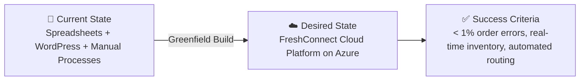

# 📋 Step 1: Requirements - nordic-fresh-foods

<strong>📑 Requirements Overview</strong>

- [🎯 Project Overview](#-project-overview)
- [🚀 Functional Requirements](#-functional-requirements)
- [⚡ Non-Functional Requirements (NFRs)](#-non-functional-requirements-nfrs)
- [🔒 Compliance & Security Requirements](#-compliance--security-requirements)
- [💰 Budget](#-budget)
- [🔧 Operational Requirements](#-operational-requirements)
- [🌍 Regional Preferences](#-regional-preferences)
- [📊 Complexity Classification](#-complexity-classification)
- [📋 Summary for Architecture Assessment](#-summary-for-architecture-assessment)
- [References](#references)

> Generated by @requirements agent | 2026-03-11

| ⬅️ Previous | 📑 Index            | Next ➡️                                                        |
| ----------- | ------------------- | -------------------------------------------------------------- |
| —           | [README](README.md) | [02-architecture-assessment.md](02-architecture-assessment.md) |

## 🎯 Project Overview

| Field                   | Value                                                                                                                 |
| ----------------------- | --------------------------------------------------------------------------------------------------------------------- |
| **Project Name**        | nordic-fresh-foods (FreshConnect MVP)                                                                                 |
| **Project Type**        | Full-Stack N-Tier Web Application                                                                                     |
| **Timeline**            | March 2026 → June 2026 (3 months to peak season)                                                                      |
| **Primary Stakeholder** | CTO, Nordic Fresh Foods                                                                                               |
| **Business Context**    | Cloud-based farm-to-table ordering platform connecting organic farmers with restaurants and consumers in Scandinavia. |
| **IaC Tool**            | Bicep                                                                                                                 |

### Business Context

| Field               | Value                                                                                                                    |
| ------------------- | ------------------------------------------------------------------------------------------------------------------------ |
| Industry / Vertical | Food & Agriculture                                                                                                       |
| Company Size        | Startup / Small (1-50 employees)                                                                                         |
| Current State       | Greenfield — no existing cloud infrastructure (spreadsheets, WordPress, manual processes)                                |
| Migration Source    | N/A (greenfield)                                                                                                         |
| Business Drivers    | Modernize operations before peak season; eliminate order errors (~8% loss); enable real-time inventory and delivery ops  |
| Success Criteria    | Reduce order errors to <1%, real-time inventory visibility, automated delivery routing, restaurant order tracking portal |

### State Transition

## 🚀 Functional Requirements

### Core Capabilities

| #   | Capability                     | Priority  | Acceptance Criteria                                                             |
| --- | ------------------------------ | --------- | ------------------------------------------------------------------------------- |
| 1   | Web-based order management     | 🔴 Must   | Orders from web portal accepted, validated, and stored with <1% error rate      |
| 2   | Real-time inventory from farms | 🔴 Must   | Farmer stock levels reflected within 5 min; overselling blocked automatically   |
| 3   | Delivery route optimization    | 🔴 Must   | Routes generated automatically; reduce wasted driver trips by >50%              |
| 4   | Restaurant order tracking      | 🔴 Must   | Restaurants can view order status and ETA in real time via web portal           |
| 5   | Consumer order placement       | 🟡 Should | Consumers can browse and order produce via web portal                           |
| 6   | Analytics dashboard            | 🟡 Should | Business reports showing order volume, revenue trends, delivery performance     |
| 7   | Mobile app API support         | 🟢 Could  | REST API endpoints designed to support future mobile app                        |
| 8   | Seasonal auto-scaling          | 🔴 Must   | Platform handles 3× order volume during summer and December without degradation |

### User Types

| User Type        | Description                                 | Est. Count | Access Level |
| ---------------- | ------------------------------------------- | ---------- | ------------ |
| Restaurant Staff | Place orders, track deliveries, view menu   | 500+       | Contributor  |
| Consumer         | Browse products, place orders               | 10,000     | Reader       |
| Farm Operator    | Update inventory, confirm produce readiness | 50-100     | Contributor  |
| Delivery Driver  | View routes, confirm pickups/deliveries     | 20-50      | Reader       |
| Operations Admin | Manage platform, view analytics, configure  | 5-10       | Admin        |

### Integrations

| System                    | Direction | Protocol | Auth Method | SLA   | EU Data Residency Required |
| ------------------------- | --------- | -------- | ----------- | ----- | -------------------------- |
| Payment Gateway           | Outbound  | REST     | API Key     | 99.9% | Yes — PII/payment tokens   |
| Mapping/Routing API       | Outbound  | REST     | API Key     | 99.5% | Yes — address data         |
| Email/SMS Notifications   | Outbound  | REST     | API Key     | 99.0% | Yes — PII (names, emails)  |
| Farm Inventory API        | Inbound   | REST     | OAuth 2.0   | 99.0% | Yes — supply chain data    |
| Social Identity Providers | Outbound  | OIDC     | OAuth 2.0   | 99.9% | Yes — PII (email, profile) |

> [!IMPORTANT]
> All external processors handling EU personal data MUST store and process
> data within the EU, or operate under an approved GDPR transfer mechanism
> (e.g., Standard Contractual Clauses). The Architect must validate processor
> compliance during Step 2.

### Data Types

| Category             | Sensitivity | Est. Volume     | Retention | Residency |
| -------------------- | ----------- | --------------- | --------- | --------- |
| Customer PII         | 🔴 High     | 10K+ records    | 3 years   | EU only   |
| Payment tokens       | 🔴 High     | 1K+ daily       | Per PCI   | EU only   |
| Order data           | 🟡 Medium   | 500+ orders/day | 2 years   | EU only   |
| Inventory levels     | 🟢 Low      | Updated hourly  | 90 days   | EU only   |
| Delivery route data  | 🟡 Medium   | 50+ routes/day  | 1 year    | EU only   |
| Analytics/aggregates | 🟢 Low      | Derived daily   | 2 years   | EU        |

### Architecture Pattern

| Field              | Value                                                                                                     |
| ------------------ | --------------------------------------------------------------------------------------------------------- |
| Workload Pattern   | N-Tier Web Application                                                                                    |
| Recommended Option | App Service + Azure SQL + Key Vault + Application Insights + Storage Account (SKUs to be sized in Step 2) |
| Tier               | Cost-Optimized                                                                                            |
| Justification      | Startup budget (<€1K/month), <100 concurrent users at MVP launch, greenfield build, Dev + Prod envs       |

> [!NOTE]
> Step 1 intentionally avoids prescribing SKUs. Step 2 (Architecture) must
> validate platform tiers against concurrency, autoscale, background processing,
> caching, and seasonal 3× peak load requirements.

## ⚡ Non-Functional Requirements (NFRs)

| WAF Pillar     | Metric             | Target                     | Current | Gap                          |
| -------------- | ------------------ | -------------------------- | ------- | ---------------------------- |
| 🔄 Reliability | SLA                | 99.9%                      | N/A     | Full build required          |
| 🔄 Reliability | RTO                | 24 hours                   | N/A     | Relaxed — acceptable for MVP |
| 🔄 Reliability | RPO                | 12 hours                   | N/A     | Relaxed — acceptable for MVP |
| ⚡ Performance | Page Load          | <3000 ms                   | N/A     | Full build required          |
| ⚡ Performance | API Response (p95) | <500 ms                    | N/A     | Full build required          |
| ⚡ Performance | Concurrent Users   | <100 (peak)                | N/A     | Full build required          |
| 🔒 Security    | Auth Method        | Entra External ID + Social | —       | —                            |
| 🔒 Security    | Encryption         | At-rest + In-transit       | —       | —                            |
| 💰 Cost        | Monthly Budget     | <€1,000                    | —       | —                            |
| 🔧 Operations  | Uptime Monitoring  | Yes                        | —       | —                            |

### Scalability

| Dimension        | Current     | 6-Month Projection | 12-Month Projection |
| ---------------- | ----------- | ------------------ | ------------------- |
| Users            | ~10,500     | ~20,000            | ~50,000             |
| Data Volume      | ~5 GB       | ~20 GB             | ~50 GB              |
| Transactions/day | ~500 orders | ~1,500 orders      | ~3,000 orders       |

## 🔒 Compliance & Security Requirements

### Regulatory Frameworks

<strong>PCI-DSS</strong> — Applicable

| Requirement             | Applicability | Notes                                                          |
| ----------------------- | ------------- | -------------------------------------------------------------- |
| Cardholder data storage | No            | Payment tokens only — PCI scope minimized via external gateway |
| Network segmentation    | Yes           | Private endpoints for data services                            |
| Encryption requirements | Yes           | TLS 1.2+ in transit, platform-managed encryption at rest       |

<strong>SOC 2</strong> — Not Applicable

| Trust Principle | Applicability | Notes                |
| --------------- | ------------- | -------------------- |
| Security        | No            | Not required for MVP |
| Availability    | No            | Not required for MVP |
| Confidentiality | No            | Not required for MVP |

<strong>HIPAA</strong> — Not Applicable

| Requirement   | Applicability | Notes                    |
| ------------- | ------------- | ------------------------ |
| PHI handling  | No            | No health data processed |
| BAA required  | No            | N/A                      |
| Audit logging | No            | N/A                      |

<strong>GDPR</strong> — Applicable

| Requirement      | Applicability | Notes                                                      |
| ---------------- | ------------- | ---------------------------------------------------------- |
| EU data subjects | Yes           | All customers are EU residents (Scandinavia)               |
| Data residency   | Yes           | All data must reside in EU regions (swedencentral primary) |
| Right to erasure | Yes           | Must support GDPR Article 17 — customer data deletion      |

<strong>ISO 27001</strong> — Not Applicable

| Control Area        | Applicability | Notes                |
| ------------------- | ------------- | -------------------- |
| Access control      | No            | Not required for MVP |
| Asset management    | No            | Not required for MVP |
| Incident management | No            | Not required for MVP |

### Data Residency

| Requirement              | Value                                      |
| ------------------------ | ------------------------------------------ |
| Primary Region           | swedencentral                              |
| Data Sovereignty         | EU-only (GDPR compliance)                  |
| Cross-region Replication | Not required (relaxed recovery objectives) |

### Environment Isolation

| Boundary        | Dev                     | Production                         |
| --------------- | ----------------------- | ---------------------------------- |
| Identity tenant | Separate Entra config   | Separate Entra config              |
| Secrets (KV)    | Dedicated Key Vault     | Dedicated Key Vault                |
| Data stores     | Separate SQL + Storage  | Separate SQL + Storage             |
| Diagnostics     | Separate Log Analytics  | Separate Log Analytics             |
| Budget alert    | Separate budget scope   | Separate budget scope              |
| Network         | Shared or separate VNet | Dedicated VNet + private endpoints |

### Authentication & Authorization

| Requirement       | Value                                                                    |
| ----------------- | ------------------------------------------------------------------------ |
| Identity Provider | Microsoft Entra External ID (consumers + restaurants) + Social providers |
| MFA Requirement   | Conditional (required for admin users)                                   |
| RBAC Model        | Application-level (role per user type)                                   |

> [!NOTE]
> Azure AD B2C is end-of-sale for new tenants since May 2025. Microsoft Entra
> External ID is the successor for greenfield consumer-facing identity.

### Network Security

| Control                     | Required | Notes                                              |
| --------------------------- | -------- | -------------------------------------------------- |
| Private endpoints           | ✅       | For Azure SQL and Storage Account                  |
| VNet integration            | ✅       | App Service VNet integration for SQL access        |
| Public endpoints acceptable | ✅       | Web frontend and API (behind App Service)          |
| WAF required                | ❌       | Not required for MVP — compensating controls below |

### Recommended Security Controls

| Control               | Recommended | User Confirmed | Notes                                            |
| --------------------- | ----------- | -------------- | ------------------------------------------------ |
| Managed Identity      | Yes         | Yes            | Prefer over keys for service-to-service          |
| Private Endpoints     | Yes         | Yes            | For Azure SQL and Storage Account                |
| WAF                   | No          | No             | Not required for MVP — add post-launch           |
| Key Vault for Secrets | Yes         | Yes            | Centralized secrets management                   |
| Diagnostic Settings   | Yes         | Yes            | Application Insights + Log Analytics             |
| TLS 1.2 Minimum       | Yes         | Yes            | Always recommended — security baseline           |
| Encryption at Rest    | Yes         | Yes            | Platform-managed encryption                      |
| Network Isolation     | Yes         | Yes            | VNet integration + private endpoints             |
| Edge Rate Limiting    | Yes         | Yes            | App Service built-in or API Management tier      |
| API Throttling        | Yes         | Yes            | Per-client rate limits on order/inventory APIs   |
| Bot Protection        | Yes         | Yes            | Basic bot detection on login and order endpoints |

## 💰 Budget

> [!NOTE]
> The Azure Pricing MCP server generates detailed cost estimates during
> architecture assessment (Step 2). Provide an approximate budget here.

| Field              | Value                                   |
| ------------------ | --------------------------------------- |
| 💰 Monthly Budget  | <€1,000/month (Azure platform only)     |
| 📅 Annual Budget   | ~€12,000 (Azure platform only)          |
| 🚦 Limit Type      | 🔴 Hard = startup runway constraints    |
| 📊 Cost Model Pref | Consumption — pay only for what is used |

### Budget Envelopes

| Category                | Monthly Envelope | Notes                                         |
| ----------------------- | ---------------- | --------------------------------------------- |
| Compute (App Service)   | ~€200-400        | Web + API; must support autoscale in peak     |
| Database (Azure SQL)    | ~€150-250        | Orders, inventory, users                      |
| Identity (Entra Ext ID) | ~€50-100         | MAU-based pricing for consumers               |
| Networking (PE + DNS)   | ~€50-100         | Private endpoints, private DNS zones          |
| Observability           | ~€50-100         | Log Analytics ingestion + App Insights        |
| Storage + Key Vault     | ~€20-50          | Blobs, secrets, certificates                  |
| **Total Azure**         | **<€1,000**      | Hard cap; Step 2 must validate feasibility    |
| 3rd-party SaaS          | Separate budget  | Payment gateway, maps, email/SMS — not in cap |

> [!IMPORTANT]
> Step 2 must estimate both steady-state and peak-season (3×) costs, including
> private networking overhead, log ingestion volume, and identity MAU charges.
> Third-party SaaS costs are tracked separately but must be surfaced in the
> cost estimate for total operational awareness.

### Cost Optimization Priorities

| Priority                         | Selected | Impact |
| -------------------------------- | -------- | ------ |
| Minimize compute costs           | ☑        | High   |
| Prefer consumption-based pricing | ☑        | High   |
| Reserved instances acceptable    | ☐        | Low    |
| Spot instances for non-critical  | ☐        | Low    |

## 🔧 Operational Requirements

### Monitoring & Alerting

| Capability             | Required | Tool / Service       | Notes                     |
| ---------------------- | -------- | -------------------- | ------------------------- |
| Application monitoring | ✅       | Application Insights | Request tracking, errors  |
| Log aggregation        | ✅       | Log Analytics        | Centralized log workspace |
| Alert notifications    | ✅       | Email                | CTO and operations team   |
| Custom dashboards      | ❌       | —                    | Not required for MVP      |

### Support & Maintenance

| Requirement         | Value                          |
| ------------------- | ------------------------------ |
| Support Hours       | Business hours (Stockholm CET) |
| On-call Requirement | No                             |
| Maintenance Windows | Weekends, 02:00-06:00 CET      |
| Change Management   | Team approval via GitHub PRs   |

### Backup & Disaster Recovery

| Component          | Backup Frequency | Retention | Recovery Method  |
| ------------------ | ---------------- | --------- | ---------------- |
| Azure SQL Database | Daily            | 30 days   | Automated (PITR) |
| Storage Account    | LRS replication  | 30 days   | Automated        |
| App Configuration  | IaC re-deploy    | N/A       | Bicep redeploy   |

## 🌍 Regional Preferences

| Preference         | Value         | Justification                              |
| ------------------ | ------------- | ------------------------------------------ |
| Primary Region     | swedencentral | EU GDPR-compliant, closest to Stockholm    |
| Failover Region    | N/A           | Not required — relaxed recovery objectives |
| Availability Zones | Not needed    | Cost optimization — single zone sufficient |

---

## 📊 Complexity Classification

| Field      | Value                                                                                                                                                                                                                                             |
| ---------- | ------------------------------------------------------------------------------------------------------------------------------------------------------------------------------------------------------------------------------------------------- |
| Complexity | `standard`                                                                                                                                                                                                                                        |
| Criteria   | 5+ resource types (App Service, SQL, KV, Storage, App Insights, VNet, Private Endpoints, Entra External ID, Log Analytics), multi-environment (Dev + Prod), GDPR + PCI-DSS compliance pressure                                                    |
| Rationale  | Although an MVP, the workload involves PII, payment-scoped data, multiple external integrations, private networking, consumer-facing identity, and dual environments — exceeding the ≤3 resource / single-env threshold for simple classification |

---

## 📋 Summary for Architecture Assessment

### Handoff Summary

| Aspect               | Key Points                                                                                                                                    |
| -------------------- | --------------------------------------------------------------------------------------------------------------------------------------------- |
| Critical Constraints | Budget <€1K/month (Azure only); 3-month timeline; EU data residency (GDPR) incl. external processors                                          |
| Key Decisions        | Bicep IaC; Cost-Optimized tier; N-Tier pattern; Entra External ID + social auth; Private endpoints; Dev + Prod envs                           |
| Open Risks           | PCI-DSS scope depends on payment gateway integration; seasonal 3× scale needs SKU validation; edge security compensating controls need sizing |
| Recommended Pattern  | N-Tier Web Application (App Service + SQL + KV + App Insights + Storage — SKUs per Step 2)                                                    |
| Budget Envelope      | <€1,000/month (Azure platform; 3rd-party tracked separately)                                                                                  |

### Requirements Completeness

| Section                  | Status | Notes                                                  |
| ------------------------ | ------ | ------------------------------------------------------ |
| Project Overview         | ✅     | All fields populated                                   |
| Functional Requirements  | ✅     | 8 capabilities with priorities and acceptance criteria |
| NFRs                     | ✅     | WAF metrics, scalability projections defined           |
| Compliance & Security    | ✅     | GDPR + PCI-DSS scoped; security controls confirmed     |
| Budget                   | ✅     | Hard limit <€1K/month; consumption model preferred     |
| Operational Requirements | ✅     | Monitoring, alerting, backup defined for MVP scope     |

---

## References

> [!NOTE]
> 📚 The following Microsoft Learn resources provide additional guidance.

| Topic                      | Link                                                                                                |
| -------------------------- | --------------------------------------------------------------------------------------------------- |
| Well-Architected Framework | [Overview](https://learn.microsoft.com/azure/well-architected/)                                     |
| Azure Regions              | [Products by Region](https://azure.microsoft.com/explore/global-infrastructure/products-by-region/) |
| Compliance Offerings       | [Azure Compliance](https://learn.microsoft.com/azure/compliance/)                                   |

---

_Requirements captured using [plan-requirements.prompt.md](../../.github/prompts/plan-requirements.prompt.md) template_

---

| ⬅️ — | 🏠 [Project Index](README.md) | ➡️ [02-architecture-assessment.md](02-architecture-assessment.md) |
| ---- | ----------------------------- | ----------------------------------------------------------------- |

