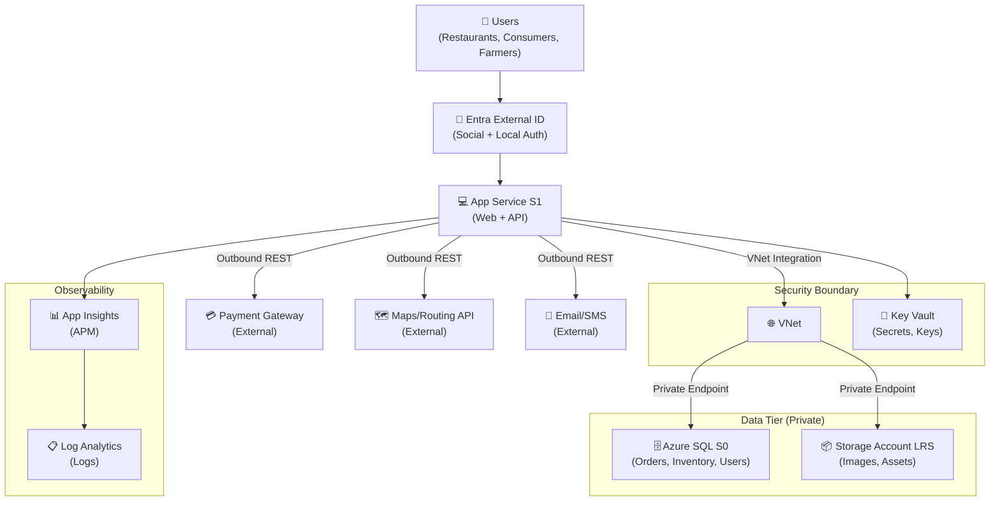
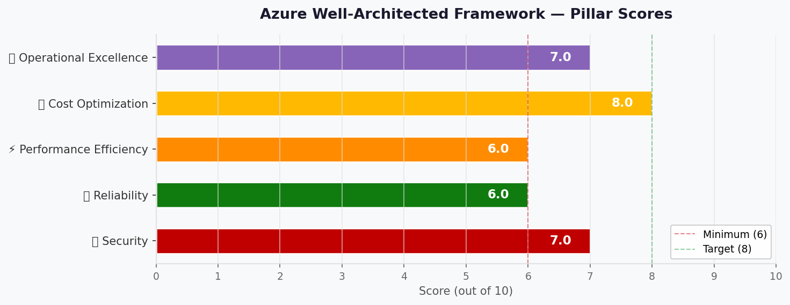

# 🏛️ Step 2: Architecture Assessment - nordic-fresh-foods

<strong>📑 Assessment Contents</strong>

- [✅ Requirements Validation](#-requirements-validation)
- [💎 Executive Summary](#-executive-summary)
- [🏛️ WAF Pillar Assessment](#-waf-pillar-assessment)
- [📦 Resource SKU Recommendations](#-resource-sku-recommendations)
- [🎯 Architecture Decision Summary](#-architecture-decision-summary)
- [🚀 Implementation Handoff](#-implementation-handoff)
- [🔒 Approval Gate](#-approval-gate)
- [References](#references)

> Generated by architect agent | 2026-03-11

| ⬅️ Previous                              | 📑 Index            | Next ➡️                                            |
| ---------------------------------------- | ------------------- | -------------------------------------------------- |
| [01-requirements.md](01-requirements.md) | [README](README.md) | [03-des-cost-estimate.md](03-des-cost-estimate.md) |

## ✅ Requirements Validation

| Requirement Area        | Status     | Validation Notes                                                                           |
| ----------------------- | ---------- | ------------------------------------------------------------------------------------------ |
| NFRs (SLA, RTO, RPO)    | ✅ Defined | SLA 99.9%, RTO 24h, RPO 12h — relaxed and appropriate for MVP                              |
| Compliance requirements | ✅ Defined | GDPR (EU data residency) + PCI-DSS (scope minimized via external payment gateway)          |
| Budget (approximate)    | ✅ Defined | <€1,000/month hard cap; consumption model preferred                                        |
| Scale requirements      | ✅ Defined | <100 concurrent users, ~500 orders/day, 3× seasonal peak, growth to 50K users in 12 months |
| Security controls       | ✅ Defined | Managed Identity, Private Endpoints, TLS 1.2, Key Vault, Entra External ID                 |
| Data residency          | ✅ Defined | EU-only (swedencentral primary); all data and processing within EU                         |

> [!NOTE]
> All requirement areas are fully defined. No blockers for architecture assessment.

---

## 💎 Executive Summary

Nordic Fresh Foods (FreshConnect MVP) is a greenfield farm-to-table ordering platform for Scandinavia. The platform connects organic farmers with restaurants and consumers, requiring real-time inventory, order management, delivery routing, and consumer-facing identity.

**Recommended approach**: N-Tier Web Application using Azure App Service (S1) for compute, Azure SQL Database (S0) for relational data, Key Vault for secrets, Storage Account for blobs, and Application Insights + Log Analytics for observability. Private Endpoints secure data services in production. Microsoft Entra External ID handles consumer and restaurant identity at no additional cost within the free MAU tier.

**Estimated monthly cost**: ~$131 (Prod + Dev steady-state) — **87% under the €1K budget**, leaving substantial headroom for growth and peak-season autoscaling ($256/mo at 3× peak).

### Recommended Architecture

---

## 🏛️ WAF Pillar Assessment

### Overall Scores

| Pillar                    | Score | Confidence | Summary                                                          |
| ------------------------- | ----- | ---------- | ---------------------------------------------------------------- |
| 🔒 Security               | 7/10  | High       | Strong identity + network isolation; WAF and DDoS deferred       |
| 🔄 Reliability            | 6/10  | High       | Single-region acceptable for MVP; automated backups in place     |
| ⚡ Performance            | 6/10  | Medium     | Autoscale handles 3× peak; no CDN or cache (deferred)            |
| 💰 Cost Optimization      | 8/10  | High       | 87% under budget; right-sized SKUs; consumption-based monitoring |
| 🔧 Operational Excellence | 7/10  | High       | Bicep IaC + App Insights APM; basic alerting only                |

**Primary Pillar Optimized**: 💰 Cost Optimization
**Trade-offs Accepted**: Reduced reliability (single region, no AZ) and performance (no cache/CDN) in exchange for staying well within startup budget constraints.

### Service Maturity Assessment

| Service              | GA Status | AVM Available | Region Support   | Notes                                              |
| -------------------- | --------- | ------------- | ---------------- | -------------------------------------------------- |
| App Service (Linux)  | ✅ GA     | ✅ Yes        | swedencentral ✅ | `br/public:avm/res/web/site`                       |
| App Service Plan     | ✅ GA     | ✅ Yes        | swedencentral ✅ | `br/public:avm/res/web/serverfarm`                 |
| Azure SQL Database   | ✅ GA     | ✅ Yes        | swedencentral ✅ | `br/public:avm/res/sql/server`                     |
| Key Vault            | ✅ GA     | ✅ Yes        | swedencentral ✅ | `br/public:avm/res/key-vault/vault`                |
| Storage Account      | ✅ GA     | ✅ Yes        | swedencentral ✅ | `br/public:avm/res/storage/storage-account`        |
| Application Insights | ✅ GA     | ✅ Yes        | swedencentral ✅ | `br/public:avm/res/insights/component`             |
| Log Analytics        | ✅ GA     | ✅ Yes        | swedencentral ✅ | `br/public:avm/res/operational-insights/workspace` |
| Virtual Network      | ✅ GA     | ✅ Yes        | swedencentral ✅ | `br/public:avm/res/network/virtual-network`        |
| Private Endpoints    | ✅ GA     | N/A (inline)  | swedencentral ✅ | Configured within parent resource AVM              |
| Entra External ID    | ✅ GA     | N/A (SaaS)    | Global           | MAU-based; not IaC-provisioned                     |

---

### 🔒 Security Assessment (7/10)

**Strengths:**

- Managed Identity for all service-to-service authentication (no keys in code)
- Private Endpoints for Azure SQL and Storage Account in production with **public network access explicitly disabled** (`publicNetworkAccess: 'Disabled'` on SQL Server; `publicNetworkAccess: 'Disabled'` and default-deny firewall on Storage)
- TLS 1.2 minimum enforced on all services
- Key Vault with RBAC authorization, purge protection, and **private endpoint or firewall** (public network access restricted with trusted-services bypass)
- Microsoft Entra External ID for **consumer/restaurant identities only** (successor to Azure AD B2C); workforce/admin access via organizational Entra tenant with MFA + PIM
- HTTPS-only enforcement on App Service and Storage Account
- PCI-DSS scope minimized via **hosted payment fields / redirect tokenization** (cardholder data never reaches App Service); payment endpoint body/header logging disabled; token storage segregated in dedicated SQL table
- VNet integration for App Service outbound traffic to private resources
- Network Security Groups on data and PE subnets; private endpoint network policies enabled on PE subnet
- App Service Managed Identity with **least-privilege data-plane roles**: Key Vault Secrets User, SQL db_datareader/db_datawriter (contained user), Storage Blob Data Contributor

**GDPR Processor Compliance Matrix:**

| Processor                 | Data Location                               | Transfer Mechanism | DPA/SCC       | Article 17 Erasure                         |
| ------------------------- | ------------------------------------------- | ------------------ | ------------- | ------------------------------------------ |
| Entra External ID         | EU (tenant configured for EU data boundary) | N/A (EU-only)      | Microsoft DPA | Delete user via Graph API                  |
| Payment Gateway           | Must confirm EU processing                  | SCC if non-EU      | Required      | Token deletion; gateway manages card data  |
| Maps/Routing API          | Must confirm EU processing                  | SCC if non-EU      | Required      | Address data ephemeral (not stored)        |
| Email/SMS Provider        | Must confirm EU processing                  | SCC if non-EU      | Required      | Contact data deletion on user erasure      |
| Social Identity Providers | Must confirm EU data handling               | SCC if non-EU      | Required      | Federated auth only; profile data in Entra |

> [!WARNING]
> Each external processor MUST be validated for EU data residency before production launch. If any processor cannot confirm EU-only processing or provide an approved transfer mechanism (SCC/DPA), an alternative must be sourced.

**Gaps:**

- No WAF/Application Gateway (deferred to post-MVP; compensating control: App Service IP restrictions + rate limiting)
- No Azure DDoS Protection Standard (compensating: App Service built-in DDoS Basic)
- No Microsoft Defender for Cloud integration (recommend enabling post-MVP)
- Bot protection limited to App Service built-in basic detection
- Azure Policy compliance is **provisional** — live governance discovery required before implementation approval (Step 4)

**Recommendations:**

1. Enable Microsoft Defender for App Service and SQL post-MVP (adds ~$15/month per resource)
2. Add Azure Application Gateway with WAF v2 when user base exceeds 5,000 concurrent users
3. Configure App Service IP restrictions and rate limiting as compensating controls for MVP
4. Implement Content Security Policy headers in the web application
5. Validate all external processor DPA/SCC compliance before production launch
6. Configure Entra External ID tenant with EU data boundary; verify no telemetry or backup data leaves EU

### 🔄 Reliability Assessment (6/10)

**Strengths:**

- App Service S1 provides 99.95% SLA; **production minimum set to 2 instances** for availability during deployments and instance failures
- Azure SQL automated backups with Point-in-Time Restore (30-day retention); geo-backup available for cross-region restore
- Storage Account LRS provides 99.9% SLA with 3× local redundancy
- Relaxed RTO 24h / RPO 12h is appropriate and achievable with PITR + IaC redeploy
- Bicep IaC enables rapid environment reconstruction if needed
- **External integration resilience**: strict timeouts (5s), bounded retries with jitter (3 max), circuit breaker pattern for payment/maps/email APIs; non-critical integrations (email/SMS, maps) decoupled via async queue processing (Azure Storage Queue)
- **SLO/Error Budget model**: 99.9% = 43.8 min/month downtime budget; critical path: App Service → SQL only; non-critical (maps, email) isolated from availability budget

**Disaster Recovery Runbook (germanywestcentral):**

| Component               | Recovery Action                                                              | Est. Time      | RPO Impact            |
| ----------------------- | ---------------------------------------------------------------------------- | -------------- | --------------------- |
| App Service             | Redeploy via Bicep to failover region                                        | 2-4 hours      | None (stateless)      |
| Azure SQL               | Geo-restore from automated geo-backup                                        | 4-8 hours      | Up to 1 hour          |
| Storage Account         | Redeploy empty + restore from backup export (or switch to GRS pre-emptively) | 2-4 hours      | Up to 24 hours (LRS)  |
| Key Vault               | Redeploy via Bicep; secrets re-provisioned                                   | 1-2 hours      | None (IaC managed)    |
| DNS Cutover             | Update App Service custom domain                                             | 30 min         | N/A                   |
| **Total estimated RTO** |                                                                              | **8-16 hours** | **Within 24h target** |

> [!NOTE]
> LRS storage does not provide cross-region recovery. If storage RPO < 24h is required post-MVP, upgrade to GRS (+~$1.50/month). Current LRS is acceptable given relaxed 12h RPO for non-SQL data.

**Gaps:**

- Single region deployment (swedencentral) — no automatic failover
- No Availability Zone redundancy (cost optimization trade-off)
- No multi-region active-passive or active-active
- DR runbook requires periodic validation through tabletop and live restore drills

**Recommendations:**

1. Enable App Service Health Check probes (`/health` endpoint) with 5-check threshold for automatic unhealthy instance replacement
2. Run DR drill (tabletop) before peak season; live restore drill within 6 months of launch
3. Define reliability escalation gates: if monthly uptime < 99.9% or ≥2 incidents in 30 days → evaluate AZ redundancy; if ≥3 region incidents → evaluate multi-region
4. Plan failover to germanywestcentral region post-MVP when user base justifies the cost

### ⚡ Performance Assessment (6/10)

**Strengths:**

- App Service S1 autoscale (2→3 instances in prod; min 2 for availability) handles seasonal 3× peak load
- Target <3s page load achievable with S1 plan and co-located services in swedencentral
- Target <500ms API p95 achievable for SQL queries against S0 (10 DTU) at current transaction volume
- VNet integration keeps App Service to SQL latency under 1ms within the same region

**Gaps:**

- No CDN for static assets (product images served directly from Storage via App Service)
- No Redis Cache for inventory hot-path data (real-time stock levels)
- No read replicas for SQL Database
- Performance under sustained 3× seasonal load (1,500 orders/day) requires load testing validation — SQL S0 (10 DTU) may need upgrade to S1 (20 DTU, +~$15/month)

**Recommendations:**

1. **Mandatory pre-peak load test**: conduct load testing at projected 3× traffic before June using Azure Load Testing; validate API p95 < 500ms under sustained load
2. Configure **multi-metric autoscale**: CPU > 70% OR average response time > 2s; scheduled pre-scale to 3 instances for known peak windows (June-August, December)
3. Monitor SQL DTU utilization; upgrade to S1 (20 DTU) if sustained usage exceeds 80%
4. Implement application-level caching for inventory data (5-minute cache aligns with farm update frequency)
5. Add Azure Front Door or CDN Standard if page load times exceed 3s target after launch

### 💰 Cost Assessment (8/10)

| Service              | SKU              | Monthly Cost | Notes                                                 |
| -------------------- | ---------------- | -----------: | ----------------------------------------------------- |
| App Service Plan     | S1 (2 instances) |      $146.00 | Linux; min 2 for availability; autoscale to 3 at peak |
| Azure SQL Database   | S0 (10 DTU)      |       $14.73 | Includes 250 GB storage                               |
| Key Vault            | Standard         |        $0.00 | ~1K ops/month; effectively free                       |
| Storage Account      | Standard LRS     |        $2.25 | ~50 GB hot storage                                    |
| Application Insights | Pay-per-GB       |        $4.60 | ~2 GB/month ingestion                                 |
| Log Analytics        | Pay-per-GB       |        $0.00 | ~3 GB/month (within 5 GB free tier)                   |
| Private Endpoint ×2  | Standard         |       $14.60 | SQL + Storage; $7.30/endpoint                         |
| Private DNS Zone ×2  | Private          |        $1.00 | $0.50/zone                                            |
| **Prod Total**       |                  |  **$183.18** | Steady-state (min 2 instances)                        |
| Dev Environment      | B1 + SQL Basic   |       $20.79 | Reduced SKUs for development                          |
| **Grand Total**      |                  |  **$203.97** | Prod + Dev steady-state                               |

**Peak Season (3× autoscale)**: ~$256/month (App Service S1 × 3 instances + variable meters)

> [!NOTE]
> Peak estimate covers compute scaling only. Variable meters (SQL DTU bursting, Log Analytics ingestion spikes, Storage transactions) may add $10-30/month during sustained peaks. See `03-des-cost-estimate.md` for p50/p90 cost bands.

**Budget Status**: $203.97 of ~$1,000 budget = **20% utilization** — well within budget with significant headroom.

**Cost Optimization Applied:**

- S1 over P1v3 saves ~$200/month while meeting performance requirements
- SQL S0 (10 DTU) over S1 (20 DTU) saves ~$15/month at current load
- Pay-per-GB monitoring over fixed commitment saves at low ingestion volumes
- Entra External ID free tier covers 50K MAU (current: ~10.5K)
- LRS over GRS saves ~$1.50/month (acceptable given relaxed DR requirements)
- B1 plan for Dev environment saves ~$60/month vs. S1

### 🔧 Operational Excellence Assessment (7/10)

**Strengths:**

- Infrastructure as Code via Bicep — fully reproducible, version-controlled deployments
- Application Insights provides request tracking, dependency mapping, error analytics
- Log Analytics centralizes logs from all Azure resources
- GitHub PR-based change management with team approval
- Automated SQL backups with PITR (30-day retention)
- Alert notifications via email to CTO and operations team
- Budget alerts at 90% threshold (€900)

**Gaps:**

- No custom operational dashboards (not required for MVP)
- No formal incident response runbooks
- No automated remediation workflows (Azure Automation)
- Basic alerting only (email) — no PagerDuty/Teams integration
- No synthetic monitoring / availability tests

**Recommendations:**

1. Configure Application Insights availability tests for key endpoints (order API, web portal)
2. Create basic alert rules for: App Service response time >3s, SQL DTU >80%, error rate >5%
3. Document incident response procedures before peak season
4. Integrate alerts with Teams channel post-MVP for faster response

---

## 📦 Resource SKU Recommendations

| Service              | Recommended SKU | Configuration                      | Monthly Est. | Justification                                                      |
| -------------------- | --------------- | ---------------------------------- | -----------: | ------------------------------------------------------------------ |
| App Service Plan     | S1              | Linux, 2 instances, autoscale 2→3  |      $146.00 | Min 2 instances for availability; autoscale to 3 for seasonal peak |
| App Service          | S1 (on plan)    | VNet integration, HTTPS-only, MI   |            — | Web + API on single app; VNet for PE access                        |
| Azure SQL Database   | S0 (10 DTU)     | TLS 1.2, Azure AD auth, geo-backup |       $14.73 | 500 orders/day, <100 concurrent; upgrade path to S1 if needed      |
| Key Vault            | Standard        | RBAC auth, purge protection        |        $0.00 | Low operation count; Standard tier sufficient                      |
| Storage Account      | Standard LRS    | HTTPS-only, no public blob, MI     |        $2.25 | Product images, assets; 50 GB initial                              |
| Application Insights | Pay-per-GB      | Connected to App Service           |        $4.60 | 2 GB/month ingestion; workspace-based                              |
| Log Analytics        | Pay-per-GB      | 30-day retention                   |        $0.00 | 3 GB/month within 5 GB free tier                                   |
| Virtual Network      | Standard        | 3 subnets (app, data, PE)          |         Free | Network isolation for private endpoints                            |
| Private Endpoint     | Standard (×2)   | SQL + Storage                      |       $14.60 | GDPR/PCI compliance; no public data access                         |
| Private DNS Zone     | Private (×2)    | SQL + Storage privatelink zones    |        $1.00 | PE name resolution                                                 |

<strong>App Service Plan</strong> — Pricing Tier Comparison

| Tier | vCPU | RAM     | Price/mo | Autoscale | Fits?                  |
| ---- | ---- | ------- | -------: | --------- | ---------------------- |
| B1   | 1    | 1.75 GB |   $13.14 | ❌ No     | ❌ No autoscale for 3× |
| S1   | 1    | 1.75 GB |   $73.00 | ✅ Yes    | ✅ Selected            |
| P1v3 | 2    | 8 GB    |    ~$138 | ✅ Yes    | ⚠️ Over-spec for MVP   |

**Selected**: S1 — minimum tier with autoscale support; required for seasonal 3× peak handling. B1 used for Dev environment only.

<strong>Azure SQL Database</strong> — Pricing Tier Comparison

| Tier  | DTU | Storage | Price/mo | Fits?                       |
| ----- | --- | ------- | -------: | --------------------------- |
| Basic | 5   | 2 GB    |    $4.90 | ❌ Too limited for joins    |
| S0    | 10  | 250 GB  |   $14.73 | ✅ Selected                 |
| S1    | 20  | 250 GB  |     ~$30 | ⚠️ Upgrade path if DTU >80% |

**Selected**: S0 — adequate for <100 concurrent users and ~500 orders/day; Basic reserved for Dev environment. Monitor DTU; upgrade to S1 at sustained >80%.

---

## 🎯 Architecture Decision Summary

| Decision                     | Choice                           | Rationale                                                                                      |
| ---------------------------- | -------------------------------- | ---------------------------------------------------------------------------------------------- |
| Compute platform             | App Service S1 (Linux)           | Managed PaaS; autoscale for 3× peak; VNet integration for PE access; lower ops burden          |
| Database                     | Azure SQL S0 (DTU model)         | Relational data (orders, inventory, users); familiar, managed; DTU model is cost-predictable   |
| Identity provider            | Microsoft Entra External ID      | Successor to Azure AD B2C (end-of-sale May 2025); free tier covers 50K MAU                     |
| Network isolation            | VNet + Private Endpoints         | GDPR + PCI-DSS mandate; private access for SQL and Storage in production                       |
| Secrets management           | Key Vault (RBAC auth)            | Centralized secrets; Managed Identity access; purge protection for compliance                  |
| Monitoring strategy          | App Insights + Log Analytics     | Workspace-based APM; centralized logs; pay-per-GB at low volumes                               |
| Storage                      | Standard LRS                     | Cost-optimized; LRS sufficient given relaxed DR (RTO 24h); product images and assets           |
| Environment separation       | Dedicated resource groups        | Dev (B1/Basic) and Prod (S1/S0) with separate KV, SQL, and monitoring per environment          |
| Autoscale strategy           | 2→3 instances (CPU-based)        | Min 2 for availability; autoscale to 3 at peak; CPU >70% or response >2s triggers              |
| WAF/DDoS protection          | Deferred to post-MVP             | Budget constraint; App Service built-in DDoS Basic + rate limiting as compensating controls    |
| Multi-region / AZ redundancy | Not included                     | Budget constraint; RTO 24h and RPO 12h achievable with single-region + PITR + IaC redeploy     |
| Payment processing           | Hosted payment fields (redirect) | PCI scope minimized — card data never touches App Service; hosted fields/redirect tokenization |
| IaC tool                     | Bicep (from Step 1)              | AVM modules available for all selected resources; native Azure tooling                         |

---

## 🚀 Implementation Handoff

### Ready for bicep-plan

The architecture is approved for implementation with the following key parameters:

| Parameter      | Value                                 |
| -------------- | ------------------------------------- |
| Region         | swedencentral                         |
| Environments   | Dev + Prod                            |
| Budget         | <€1,000/month (estimated: $204/month) |
| Resource Count | 10 distinct resource types            |
| IaC Tool       | Bicep (AVM-first)                     |
| Complexity     | Standard                              |

### Resources to Provision

| #   | Resource                   | SKU (Prod)      | SKU (Dev)       | Key Config                                     |
| --- | -------------------------- | --------------- | --------------- | ---------------------------------------------- |
| 1   | Resource Group             | —               | —               | `rg-nordic-fresh-foods-{env}`                  |
| 2   | App Service Plan           | S1 (Linux)      | B1 (Linux)      | Min 2 instances, autoscale 2→3 (prod)          |
| 3   | App Service                | S1              | B1              | VNet integration, HTTPS-only, Managed Identity |
| 4   | Azure SQL Server           | —               | —               | Azure AD-only auth, TLS 1.2                    |
| 5   | Azure SQL Database         | S0 (10 DTU)     | Basic (5 DTU)   | Geo-backup, PITR 30 days                       |
| 6   | Key Vault                  | Standard        | Standard        | RBAC auth, purge protection, MI access         |
| 7   | Storage Account            | Standard LRS    | Standard LRS    | HTTPS-only, no public blob, MI access          |
| 8   | Log Analytics Workspace    | Pay-per-GB      | Pay-per-GB      | 30-day retention                               |
| 9   | Application Insights       | Workspace-based | Workspace-based | Connected to App Service                       |
| 10  | Virtual Network            | 3 subnets       | 1 subnet        | app-subnet, data-subnet, pe-subnet (prod)      |
| 11  | Private Endpoint (SQL)     | Standard        | —               | Prod only; privatelink.database.windows.net    |
| 12  | Private Endpoint (Storage) | Standard        | —               | Prod only; privatelink.blob.core.windows.net   |
| 13  | Private DNS Zones (×2)     | Private         | —               | Prod only; SQL + Storage privatelink zones     |
| 14  | Budget Alert               | —               | —               | €900 threshold (90% of budget)                 |

### Security Requirements for Implementation

| Requirement           | Implementation                                                                 |
| --------------------- | ------------------------------------------------------------------------------ |
| Managed Identity      | System-assigned MI on App Service; RBAC to KV, SQL, Storage                    |
| Private Endpoints     | PE for SQL + Storage in `pe-subnet`; `publicNetworkAccess: 'Disabled'` on both |
| TLS 1.2 minimum       | `minTlsVersion: 'TLS1_2'` on all services                                      |
| HTTPS-only            | `httpsOnly: true` on App Service; `supportsHttpsTrafficOnly: true` on Storage  |
| Key Vault RBAC        | `enableRbacAuthorization: true`; purge protection enabled                      |
| No public blob access | `allowBlobPublicAccess: false` on Storage Account                              |
| Azure AD-only SQL     | `azureADOnlyAuthentication: true` on SQL Server                                |
| VNet integration      | App Service delegated to `app-subnet`                                          |

### Monitoring Requirements for Implementation

| Requirement            | Implementation                                                 |
| ---------------------- | -------------------------------------------------------------- |
| Application monitoring | Application Insights workspace-based; connected to App Service |
| Log aggregation        | Log Analytics workspace; diagnostic settings on all resources  |
| Alert rules            | Response time >3s, DTU >80%, error rate >5%, budget >90%       |
| Health checks          | App Service health check endpoint configured                   |
| Budget monitoring      | Azure Budget alert at €900 (90%) with email notification       |

---

## 🔒 Approval Gate

> [!IMPORTANT]
> **🏗️ Architecture Assessment Complete**
>
> | Pillar      | Score |
> | ----------- | ----- |
> | Security    | 7/10  |
> | Reliability | 6/10  |
> | Performance | 6/10  |
> | Cost        | 8/10  |
> | Operations  | 7/10  |
>
> **Composite WAF Score**: 6.8/10
>
> **Estimated Monthly Cost**: ~$204 (Prod + Dev steady-state) — **80% under €1K budget**
> **Peak Season Cost**: ~$256-286/month (3× autoscale + variable meters)
>
> **Confidence Level**: Medium-High
>
> - [ ] **Approved** — proceed to bicep-plan
> - Approver:
> - Date:
>
> Reply **"approve"** to proceed to bicep-plan, or provide feedback for revisions.

---

## References

> [!NOTE]
> 📚 The following Microsoft Learn resources informed this assessment.

| Topic                      | Link                                                                                        |
| -------------------------- | ------------------------------------------------------------------------------------------- |
| Well-Architected Framework | [Overview](https://learn.microsoft.com/azure/well-architected/)                             |
| Security Checklist         | [WAF Security](https://learn.microsoft.com/azure/well-architected/security/checklist)       |
| Reliability Checklist      | [WAF Reliability](https://learn.microsoft.com/azure/well-architected/reliability/checklist) |
| Cost Optimization          | [WAF Cost](https://learn.microsoft.com/azure/well-architected/cost-optimization/checklist)  |
| Azure Pricing Calculator   | [Calculator](https://azure.microsoft.com/pricing/calculator/)                               |
| App Service Autoscale      | [Autoscale](https://learn.microsoft.com/azure/app-service/manage-scale-up)                  |
| Private Endpoints          | [Overview](https://learn.microsoft.com/azure/private-link/private-endpoint-overview)        |
| Entra External ID          | [Overview](https://learn.microsoft.com/entra/external-id/)                                  |
| AVM Bicep Modules          | [Registry](https://aka.ms/avm/index)                                                        |

---

_Assessment performed using Azure Well-Architected Framework. Pricing data from Azure Pricing MCP (2026-03-11)._

---

| ⬅️ [01-requirements.md](01-requirements.md) | 🏠 [Project Index](README.md) | ➡️ [03-des-cost-estimate.md](03-des-cost-estimate.md) |
| ------------------------------------------- | ----------------------------- | ----------------------------------------------------- |

