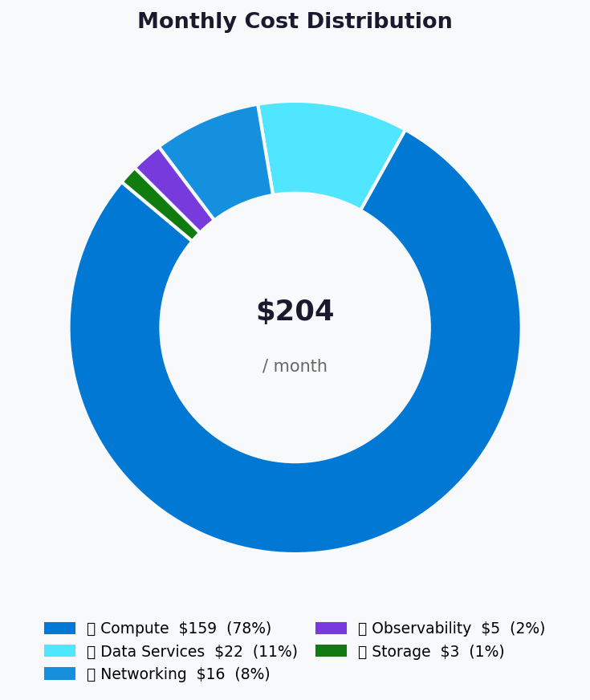
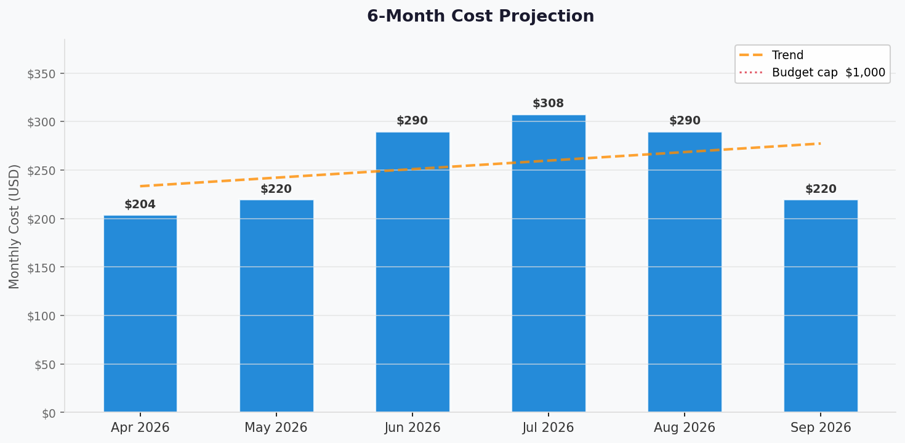

# 💰 Azure Cost Estimate: nordic-fresh-foods


<details open>
<summary><strong>📑 Cost Estimate Contents</strong></summary>

- [💵 Cost At-a-Glance](#-cost-at-a-glance)
- [✅ Decision Summary](#-decision-summary)
- [🔁 Requirements → Cost Mapping](#-requirements--cost-mapping)
- [📊 Top 5 Cost Drivers](#-top-5-cost-drivers)
- [🏛️ Architecture Overview](#-architecture-overview)
- [🧾 What We Are Not Paying For (Yet)](#-what-we-are-not-paying-for-yet)
- [⚠️ Cost Risk Indicators](#-cost-risk-indicators)
- [🎯 Quick Decision Matrix](#-quick-decision-matrix)
- [💰 Savings Opportunities](#-savings-opportunities)
- [🧾 Detailed Cost Breakdown](#-detailed-cost-breakdown)
- [References](#references)

</details>

> Generated by architect agent | 2026-03-11

| ⬅️ Previous                                                    | 📑 Index            | Next ➡️                                                      |
| -------------------------------------------------------------- | ------------------- | ------------------------------------------------------------ |
| [02-architecture-assessment.md](02-architecture-assessment.md) | [README](README.md) | [04-governance-constraints.md](04-governance-constraints.md) |

**Generated**: 2026-03-11
**Region**: swedencentral
**Environment**: Production + Development
**MCP Tools Used**: azure_bulk_estimate, azure_cost_estimate, azure_price_search
**Architecture Reference**: [02-architecture-assessment.md](02-architecture-assessment.md)

## 💵 Cost At-a-Glance

> **Monthly Total: ~$204** | Annual: ~$2,448
>
> ```text
> Budget: €1,000/month (hard) | Utilization: 20% ($204 of ~$1,000)
> ```
>
> | Status            | Indicator                                     |
> | ----------------- | --------------------------------------------- |
> | Cost Trend        | ➡️ Stable (growth driven by user acquisition) |
> | Savings Available | 💰 ~$180/year with Dev/Test licensing         |
> | Compliance        | ✅ GDPR + PCI-DSS aligned                     |

## ✅ Decision Summary

- ✅ Approved: N-Tier Web (App Service S1 ×2 instances + SQL S0 + KV + Storage + App Insights) with Private Endpoints for Prod; B1 + Basic for Dev
- ⏳ Deferred: Redis Cache, CDN/Front Door, WAF/Application Gateway, DDoS Standard, multi-region failover
- 🔁 Redesign Trigger: If concurrent users exceed 500 or SQL DTU sustained >80%, upgrade compute/database tier

**Confidence**: Medium | **Expected Variance**: ±15% (Log Analytics ingestion and autoscale frequency are primary unknowns)

## 🔁 Requirements → Cost Mapping

| Requirement                   | Architecture Decision                    | Cost Impact          | Mandatory |
| ----------------------------- | ---------------------------------------- | -------------------- | --------- |
| SLA 99.9% / RTO 24h / RPO 12h | Single region, App Service S1, SQL PITR  | Baseline (no uplift) | Yes       |
| GDPR data residency           | swedencentral region, EU-only processing | $0 (region choice)   | Yes       |
| PCI-DSS (tokens only)         | Private Endpoints for SQL + Storage      | +$15.60/month        | Yes       |
| 3× seasonal autoscale         | App Service autoscale 2→3 instances      | +$73/month at peak   | Yes       |
| <100 concurrent users         | S1 plan + SQL S0 (10 DTU)                | Baseline sizing      | Yes       |
| Consumer identity             | Entra External ID (free tier)            | $0 (within 50K MAU)  | Yes       |
| Monitoring + alerting         | App Insights + Log Analytics (pay/GB)    | +$4.60/month         | Yes       |

## 📊 Top 5 Cost Drivers

| Rank | Resource                   | Monthly Cost | % of Total | Trend | Optimization                        |
| ---- | -------------------------- | -----------: | ---------: | ----- | ----------------------------------- |
| 1️⃣   | App Service Plan S1 (Prod) |      $146.00 |        72% | ⬆️    | Min 2 for availability; scale to 3  |
| 2️⃣   | Azure SQL Database S0      |       $14.73 |         7% | ➡️    | Monitor DTU; stay on S0 if <80%     |
| 3️⃣   | Private Endpoints ×2       |       $14.60 |         7% | ➡️    | Fixed cost; required for compliance |
| 4️⃣   | App Service Plan B1 (Dev)  |       $13.14 |         6% | ➡️    | Stop/deallocate when not in use     |
| 5️⃣   | Azure SQL Database Basic   |        $4.90 |         2% | ➡️    | Dev only; pause outside work hours  |

> 💡 **Quick Win**: Stop the Dev App Service Plan outside business hours to save ~$9/month (~$108/year).

<details>
<summary><strong>Cost Driver Details</strong></summary>

#### 1️⃣ App Service Plan S1 (Production)

| Aspect            | Detail                                            |
| ----------------- | ------------------------------------------------- |
| Current SKU       | S1 (Linux)                                        |
| Monthly Cost      | $146.00 (2 instances × $73.00)                    |
| Cost Breakdown    | Compute: $73.00/instance (flat rate per instance) |
| Optimization      | Min 2 for availability; cannot reduce below 2     |
| Potential Savings | ~$15/month with 1-year RI (if available)          |

#### 2️⃣ Azure SQL Database S0

| Aspect            | Detail                           |
| ----------------- | -------------------------------- |
| Current SKU       | S0 (10 DTU)                      |
| Monthly Cost      | $14.73                           |
| Optimization      | Stay on S0 while DTU <80%        |
| Potential Savings | $0 (already minimum viable tier) |

</details>

## 🏛️ Architecture Overview

### Cost Distribution

| Category         | Monthly Cost (USD) | Share |
| ---------------- | -----------------: | ----: |
| 💻 Compute       |            $159.14 |   78% |
| 💾 Data Services |             $21.88 |   11% |
| 🌐 Networking    |             $15.60 |    8% |
| 📊 Observability |              $4.60 |    2% |
| 🔑 Security      |              $0.00 |    0% |
| 📦 Storage       |              $2.75 |    1% |



### Month-over-Month Projection



### Key Design Decisions Affecting Cost

| Decision                 |       Cost Impact | Business Rationale                            | Status   |
| ------------------------ | ----------------: | --------------------------------------------- | -------- |
| S1 over B1 (Prod)        | +$132.86/month 📈 | Autoscale + min 2 instances for availability  | Required |
| Private Endpoints (×2)   |  +$15.60/month 📈 | GDPR + PCI-DSS compliance mandates            | Required |
| S0 over Basic (Prod SQL) |   +$9.83/month 📈 | 10 DTU needed for concurrent order processing | Required |
| Pay-per-GB monitoring    | Cost-effective 📉 | Low ingestion volumes (<5 GB/month total)     | Required |
| Single region            |   -$100+/month 📉 | No failover region cost; acceptable for MVP   | Optional |

## 🧾 What We Are Not Paying For (Yet)

- **Azure Front Door / CDN** — Add when page load exceeds 3s target ($35-50/month)
- **Redis Cache (Basic C0)** — Add if inventory API latency exceeds 500ms (~$15/month)
- **WAF v2 / Application Gateway** — Add at >5K concurrent users (~$250/month)
- **DDoS Protection Standard** — Add if targeted attacks detected (~$2,944/month)
- **Multi-region active-passive** — Add if 24h RTO becomes unacceptable (doubles infrastructure cost)
- **Microsoft Defender for Cloud** — Recommended post-MVP (~$15/resource/month)
- **Azure Front Door Premium** — For Private Link origins and advanced WAF rules

### Assumptions & Uncertainty

- Log Analytics ingestion stays within 5 GB/month free tier (monitor after launch)
- Autoscale triggers infrequently outside peak season (June-August, December)
- Storage growth averages 5 GB/month for first 6 months
- Entra External ID stays within 50K MAU free tier for 12+ months
- No cross-region data transfer costs (single region)

## ⚠️ Cost Risk Indicators

| Resource             | Risk Level | Issue                                       | Mitigation                               |
| -------------------- | ---------- | ------------------------------------------- | ---------------------------------------- |
| App Service S1 (×3)  | 🟡 Medium  | Scaling to 3rd instance at peak adds $73/mo | Set max instances to 3; monitor closely  |
| Log Analytics        | 🟡 Medium  | Ingestion may exceed 5 GB free tier         | Configure sampling rate; exclude verbose |
| SQL Database S0      | 🟢 Low     | DTU exhaustion during peaks                 | Alert at 80% DTU; upgrade to S1 ($30/mo) |
| Storage transactions | 🟢 Low     | High transaction volume from images         | Enable CDN if transaction costs spike    |

> **⚠️ Watch Item**: Peak-season autoscale (June-August) could maintain 3 instances for extended periods, pushing monthly cost to $277-308. Set autoscale cool-down to 10 minutes to avoid unnecessary scale-out.

## 🎯 Quick Decision Matrix

_"If you need X, expect to pay Y more"_

| Requirement                 | Additional Cost | SKU Change            | Verdict    | Notes                                |
| --------------------------- | --------------- | --------------------- | ---------- | ------------------------------------ |
| 99.99% SLA                  | +$65/month      | P1v3 + Zone-redundant | 🟡 Monitor | Wait until user base justifies       |
| Redis Cache (hot inventory) | +$15/month      | C0 Basic              | 🟢 Go      | Add when inventory API >500ms p95    |
| CDN for static assets       | +$35/month      | Standard profile      | 🟢 Go      | Add when page load >3s target        |
| WAF + Application Gateway   | +$250/month     | WAF_v2                | 🔴 Defer   | Over budget for MVP; add post-launch |
| Multi-region failover       | +$130/month     | Duplicate stack       | 🔴 Defer   | RTO 24h acceptable for MVP           |
| SQL S1 (20 DTU)             | +$15/month      | S1                    | 🟡 Monitor | Trigger: sustained DTU >80%          |

## 💰 Savings Opportunities

> ### Total Potential Savings: ~$180/year
>
> | Strategy                | Commitment | Monthly Savings | Annual Savings | % Reduction |
> | ----------------------- | ---------- | --------------- | -------------- | ----------- |
> | Dev/Test pricing        | N/A        | $15             | $180           | 11%         |
> | Stop Dev outside hours  | N/A        | $9              | $108           | 7%          |
> | Reserved Instances (RI) | 1-year     | Not recommended | —              | —           |
> | Spot Instances          | N/A        | Not applicable  | —              | —           |
>
> **Note**: RIs not recommended for a 3-month-old startup with uncertain growth trajectory. Re-evaluate after 6 months of stable usage.

## 🧾 Detailed Cost Breakdown

### Assumptions

- Hours: 730 hours/month
- Network egress: Minimal (<1 GB/month within region)
- Storage growth: 5 GB/month for first 6 months
- Log ingestion: 2 GB App Insights + 3 GB Log Analytics = 5 GB total

### Line Items

| Category          | Service              | SKU / Meter         | Quantity / Units | Est. Monthly |
| ----------------- | -------------------- | ------------------- | ---------------- | -----------: |
| 💻 Compute (Prod) | App Service Plan     | S1 Linux            | 2 instances      |      $146.00 |
| 💻 Compute (Dev)  | App Service Plan     | B1 Linux            | 1 instance       |       $13.14 |
| 💾 Data (Prod)    | Azure SQL Database   | S0 (10 DTU)         | 1 database       |       $14.73 |
| 💾 Data (Dev)     | Azure SQL Database   | Basic (5 DTU)       | 1 database       |        $4.90 |
| 📦 Storage (Prod) | Storage Account      | Standard LRS        | 50 GB            |        $2.25 |
| 📦 Storage (Dev)  | Storage Account      | Standard LRS        | 10 GB            |        $0.45 |
| 🔑 Security       | Key Vault (Prod)     | Standard            | ~1K ops          |        $0.00 |
| 🔑 Security       | Key Vault (Dev)      | Standard            | Minimal ops      |        $0.00 |
| 📊 Observability  | Application Insights | Pay-per-GB          | 2 GB             |        $4.60 |
| 📊 Observability  | Log Analytics        | Pay-per-GB          | 3 GB (free tier) |        $0.00 |
| 📊 Observability  | App Insights (Dev)   | Pay-per-GB          | 1 GB             |        $2.30 |
| 🌐 Networking     | Private Endpoint     | SQL                 | 730 hours        |        $7.30 |
| 🌐 Networking     | Private Endpoint     | Storage             | 730 hours        |        $7.30 |
| 🌐 Networking     | Private DNS Zone     | SQL privatelink     | 1 zone           |        $0.50 |
| 🌐 Networking     | Private DNS Zone     | Storage privatelink | 1 zone           |        $0.50 |
| 🆔 Identity       | Entra External ID    | Free tier           | ~10.5K MAU       |        $0.00 |
| **Total**         |                      |                     |                  |  **$203.97** |

### Peak Season Scenario

| Change                  | Steady-State |   Peak (3×) |       Delta |
| ----------------------- | -----------: | ----------: | ----------: |
| App Service Plan (Prod) |      $146.00 |     $219.00 |     +$73.00 |
| All other resources     |       $57.97 |      $57.97 |       $0.00 |
| **Compute Total**       |  **$203.97** | **$276.97** | **+$73.00** |

**Variable Meter Sensitivity (Peak Season):**

| Meter                          | p50 Scenario | p90 Scenario | Notes                                     |
| ------------------------------ | -----------: | -----------: | ----------------------------------------- |
| SQL DTU bursting               |        $0.00 |       $15.00 | Upgrade to S1 if sustained >80% DTU       |
| Log Analytics ingestion        |        $0.00 |        $5.00 | Free tier (5 GB) may be exceeded at peak  |
| App Insights extra ingestion   |       +$2.30 |       +$6.90 | 1-3 GB extra at 3× traffic                |
| Storage transactions           |        $0.50 |        $3.00 | Image serving transaction volume increase |
| Network egress (inter-zone)    |        $0.00 |        $1.00 | Minimal; single-region                    |
| **Variable Total**             |    **$2.80** |   **$30.90** |                                           |
| **Grand Peak Total (p50/p90)** |  **$279.77** |  **$307.87** | Compute + variable meters                 |

> [!NOTE]
> Peak assumes full-month autoscale to 3 instances. Actual peak months (June-August, December) will vary based on scale-out duration. Variable meters represent additional consumption-based costs beyond fixed compute.

### Free-Tier Cliff Analysis

| Service           | Free Tier Limit | Current Usage |    Cliff Cost | Trigger                   |
| ----------------- | --------------- | ------------- | ------------: | ------------------------- |
| Log Analytics     | 5 GB/month      | ~3 GB         |     +$2.76/GB | Verbose logging at peak   |
| Entra External ID | 50K MAU         | ~10.5K MAU    |  $0.0025/auth | Unlikely within 12 months |
| Key Vault         | 10K ops free    | ~1K ops       | $0.03/10K ops | Very unlikely             |

### Notes

- App Service Plan S1 is not eligible for Reserved Instances; RI applies to P-series and above
- Dev/Test pricing via Visual Studio subscription can reduce App Service and SQL costs
- Entra External ID free tier covers first 50K MAU — no cost until user base exceeds this threshold
- Azure SQL geo-backup is included at no additional cost with S0 tier
- Private DNS Zone billing: $0.50/zone/month + $0.0004/million queries (negligible)

---

## References

| Topic                    | Link                                                                                                                   |
| ------------------------ | ---------------------------------------------------------------------------------------------------------------------- |
| Azure Pricing Calculator | [Calculator](https://azure.microsoft.com/pricing/calculator/)                                                          |
| Cost Management          | [Overview](https://learn.microsoft.com/azure/cost-management-billing/costs/overview-cost-management)                   |
| Reserved Instances       | [Reservations](https://learn.microsoft.com/azure/cost-management-billing/reservations/save-compute-costs-reservations) |
| WAF Cost Optimization    | [Checklist](https://learn.microsoft.com/azure/well-architected/cost-optimization/checklist)                            |
| App Service Pricing      | [Pricing](https://azure.microsoft.com/pricing/details/app-service/linux/)                                              |
| SQL Database Pricing     | [Pricing](https://azure.microsoft.com/pricing/details/azure-sql-database/single/)                                      |

---

<div align="center">

| ⬅️ [02-architecture-assessment.md](02-architecture-assessment.md) | 🏠 [Project Index](README.md) | ➡️ [04-governance-constraints.md](04-governance-constraints.md) |
| ----------------------------------------------------------------- | ----------------------------- | --------------------------------------------------------------- |

</div>
