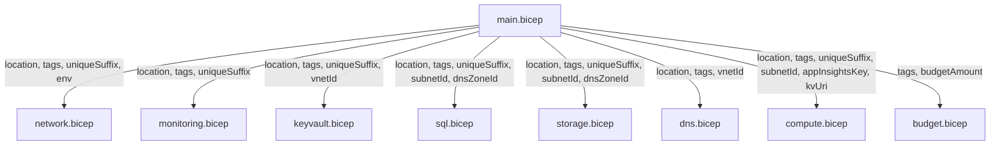
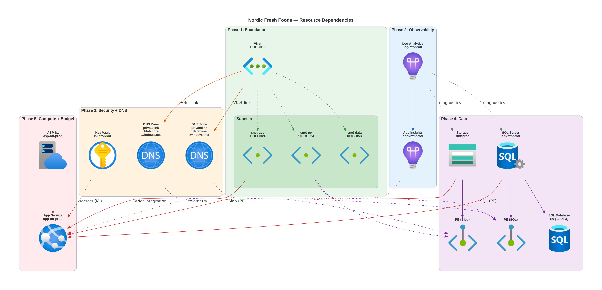
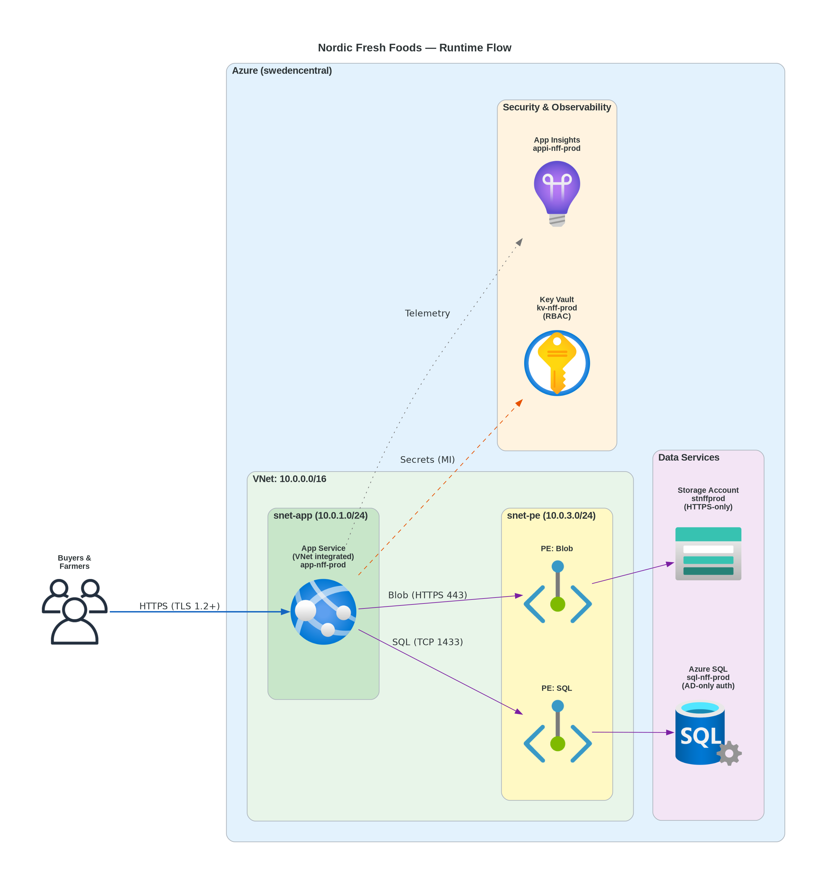

# 📋 Step 4: Implementation Plan - nordic-fresh-foods


> Generated by Bicep Planner agent | 2026-03-11

| ⬅️ Previous                                                  | 📑 Index            | Next ➡️                                                                  |
| ------------------------------------------------------------ | ------------------- | ------------------------------------------------------------------------ |
| [04-governance-constraints.md](04-governance-constraints.md) | [README](README.md) | [infra/bicep/nordic-fresh-foods/](../../infra/bicep/nordic-fresh-foods/) |

---

## 📋 Overview

This plan defines the Bicep implementation for the Nordic Fresh Foods (FreshConnect MVP) platform — a cost-optimized N-tier web application in `swedencentral`. The deployment uses **Azure Verified Modules (AVM)** for all resources and a **5-phase deployment strategy** with approval gates.

| Property                   | Value                           |
| -------------------------- | ------------------------------- |
| **Project**                | nordic-fresh-foods              |
| **IaC Tool**               | Bicep (AVM-first)               |
| **Region**                 | swedencentral                   |
| **Environments**           | Dev + Prod                      |
| **Deployment Strategy**    | Phased (5 phases)               |
| **Total Resources**        | 19 resource types               |
| **Estimated Monthly Cost** | ~$204 (Prod + Dev steady-state) |
| **Budget**                 | <€1,000/month                   |
| **Compliance**             | GDPR, PCI-DSS                   |

### Key Governance Findings

- **9 mandatory tags** on resource groups (Azure Policy Deny) — expanded from original 4
- **Azure AD-only auth** required on SQL Server (MCAPSGov Deny)
- **MFA required** for deployment operations (Management Group Deny)
- Tag inheritance via Modify policy: 9 tags auto-propagate from RG to child resources

See [04-governance-constraints.md](04-governance-constraints.md) for full details.

---

## 📦 Resource Inventory

### Production Environment

| #   | Resource                | Type                                       | AVM Module                                         | Version            | SKU / Tier                          |
| --- | ----------------------- | ------------------------------------------ | -------------------------------------------------- | ------------------ | ----------------------------------- | --------------------------- |
| 1   | Resource Group          | `Microsoft.Resources/resourceGroups`       | N/A (subscription-level)                           | —                  | —                                   |
| 2   | Virtual Network         | `Microsoft.Network/virtualNetworks`        | `br/public:avm/res/network/virtual-network`        | `0.7.2`            | Standard (3 subnets)                |
| 3   | Log Analytics Workspace | `Microsoft.OperationalInsights/workspaces` | `br/public:avm/res/operational-insights/workspace` | `0.15.0`           | Pay-per-GB                          |
| 4   | Application Insights    | `Microsoft.Insights/components`            | `br/public:avm/res/insights/component`             | `0.7.1`            | Workspace-based                     |
| 5   | Key Vault               | `Microsoft.KeyVault/vaults`                | `br/public:avm/res/key-vault/vault`                | `0.13.3`           | Standard                            |
| 6   | Azure SQL Server        | `Microsoft.Sql/servers`                    | `br/public:avm/res/sql/server`                     | `0.21.1`           | —                                   |
| 7   | Azure SQL Database      | `Microsoft.Sql/servers/databases`          | (via SQL Server module)                            | —                  | S0 (10 DTU)                         |
| 8   | Storage Account         | `Microsoft.Storage/storageAccounts`        | `br/public:avm/res/storage/storage-account`        | `0.32.0`           | Standard LRS                        |
| 9   | Private DNS Zone (SQL)  | `Microsoft.Network/privateDnsZones`        | `br/public:avm/res/network/private-dns-zone`       | `0.8.1`            | `privatelink.database.windows.net`  |
| 10  | Private DNS Zone (Blob) | `Microsoft.Network/privateDnsZones`        | `br/public:avm/res/network/private-dns-zone`       | `0.8.1`            | `privatelink.blob.core.windows.net` |
| 11  | Private Endpoint (SQL)  | `Microsoft.Network/privateEndpoints`       | `br/public:avm/res/network/private-endpoint`       | `0.12.0`           | —                                   |
| 12  | Private Endpoint (Blob) | `Microsoft.Network/privateEndpoints`       | `br/public:avm/res/network/private-endpoint`       | `0.12.0`           | —                                   |
| 13  | App Service Plan        | `Microsoft.Web/serverfarms`                | `br/public:avm/res/web/serverfarm`                 | `0.7.0`            | S1 Linux (2 instances)              |
| 14  | App Service             | `Microsoft.Web/sites`                      | `br/public:avm/res/web/site`                       | `0.22.0`           | S1 (on plan)                        |
| 15  | 15                      | Budget Alert (Aggregate)                   | `Microsoft.Consumption/budgets`                    | Raw Bicep resource | —                                   | €1,000/month (subscription) |
| 16  | Budget Alert (Prod)     | `Microsoft.Consumption/budgets`            | Raw Bicep resource                                 | —                  | €800/month (RG-scoped)              |
| 17  | Budget Alert (Dev)      | `Microsoft.Consumption/budgets`            | Raw Bicep resource                                 | —                  | €200/month (RG-scoped)              |
| 18  | Private DNS Zone (KV)   | `Microsoft.Network/privateDnsZones`        | `br/public:avm/res/network/private-dns-zone`       | `0.8.1`            | `privatelink.vaultcore.azure.net`   |
| 19  | Private Endpoint (KV)   | `Microsoft.Network/privateEndpoints`       | `br/public:avm/res/network/private-endpoint`       | `0.12.0`           | —                                   |

### Dev Environment Overrides

| Resource           | Prod SKU          | Dev SKU         | Notes               |
| ------------------ | ----------------- | --------------- | ------------------- |
| App Service Plan   | S1 (2 instances)  | B1 (1 instance) | No autoscale in dev |
| Azure SQL Database | S0 (10 DTU)       | Basic (5 DTU)   | Reduced capacity    |
| Virtual Network    | 3 subnets         | 1 subnet        | No PE subnet in dev |
| Private Endpoints  | 2 (SQL + Storage) | 0               | Not needed for dev  |
| Private DNS Zones  | 2                 | 0               | Not needed for dev  |

---

## 🗂️ Module Structure

```text
infra/bicep/nordic-fresh-foods/
├── main.bicep                      # Orchestrator — all module calls
├── main.bicepparam                 # Parameter file (prod defaults)
├── main.dev.bicepparam             # Parameter file (dev overrides)
├── deploy.ps1                      # Deployment script (phased)
├── modules/
│   ├── network.bicep               # VNet + subnets + NSGs
│   ├── monitoring.bicep            # Log Analytics + App Insights
│   ├── keyvault.bicep              # Key Vault + access policies
│   ├── sql.bicep                   # SQL Server + Database + PE
│   ├── storage.bicep               # Storage Account + PE
│   ├── dns.bicep                   # Private DNS Zones + VNet links
│   ├── compute.bicep               # App Service Plan + App Service
│   └── budget.bicep                # Consumption budget + alerts
```

### Module Interface Contract

Every module accepts these standard parameters:

```yaml
Parameters (standard):
  location: string # Region (default: resourceGroup().location)
  tags: object # All 11 tags (9 policy + 2 best-practice)
  uniqueSuffix: string # uniqueString(resourceGroup().id)
  environment: string # 'dev' | 'prod'

# Policy-enforced tag keys (EXACT names from Azure Policy Deny rule):
#   1. environment          2. owner
#   3. costcenter           4. application
#   5. workload             6. sla
#   7. backup-policy        8. maint-window
#   9. technical-contact
# Best-practice additions: ManagedBy, Project

Parameters (module-specific):
  # Each module defines additional params as needed

Outputs (standard):
  resourceId: string # Resource ID
  resourceName: string # Resource name
  principalId: string # Managed Identity principal (where applicable)
```

### Parameter Flow



---

## 🔨 Implementation Tasks

### Task 1: main.bicep — Orchestrator

```yaml
resource: main.bicep
type: orchestrator
dependencies: []
config:
  - Define all parameters (location, environment, tags, SKU overrides)
  - Generate uniqueSuffix: uniqueString(resourceGroup().id)
  - Build consolidated tags object with EXACT policy-enforced keys:
      environment, owner, costcenter, application, workload, sla,
      backup-policy, maint-window, technical-contact
      + ManagedBy, Project (best-practice)
  - Call all modules in dependency order
  - Output key resource IDs and endpoints
```

### Task 2: network.bicep — Virtual Network

```yaml
resource: Microsoft.Network/virtualNetworks
module: br/public:avm/res/network/virtual-network:0.7.2
sku: Standard
dependencies: []
config:
  name: vnet-nordic-fresh-foods-{env}
  addressPrefixes: ["10.0.0.0/16"]
  subnets:
    - name: snet-app
      addressPrefix: "10.0.1.0/24"
      delegation: Microsoft.Web/serverFarms
      nsg: nsg-app-{env}
    - name: snet-data
      addressPrefix: "10.0.2.0/24"
      nsg: nsg-data-{env}
    - name: snet-pe
      addressPrefix: "10.0.3.0/24"
      nsg: nsg-pe-{env}
      privateEndpointNetworkPolicies: Enabled
  conditional: Dev uses snet-app only (no snet-pe, synthetic data only)
  diagnosticSettings:
    vnet:
      workspaceResourceId: logAnalytics.outputs.resourceId
      categoryGroup: allLogs # VMProtectionAlerts
      metricCategories: AllMetrics
    nsg: # All NSGs — NetworkSecurityGroupEvent + RuleCounter
      workspaceResourceId: logAnalytics.outputs.resourceId
      categoryGroup: allLogs
  tags: all 11 tags
  naming: CAF — vnet-{project}-{env}
```

### Task 3: monitoring.bicep — Log Analytics + Application Insights

```yaml
resource: Microsoft.OperationalInsights/workspaces + Microsoft.Insights/components
modules:
  - br/public:avm/res/operational-insights/workspace:0.15.0
  - br/public:avm/res/insights/component:0.7.1
sku: Pay-per-GB
dependencies: []
config:
  logAnalytics:
    name: log-nordic-fresh-foods-{env}
    retentionInDays: 30
    dailyQuotaGb: 5
  appInsights:
    name: appi-nordic-fresh-foods-{env}
    kind: web
    applicationType: web
    workspaceResourceId: logAnalytics.outputs.resourceId
    samplingPercentage: 50 # reduce ingestion cost; tune post-launch
  ingestionGuardrails:
    prod:
      dailyQuotaGb: 2 # aligned to ~$204 cost estimate
      expectedMonthlyGb: 1-3
    dev:
      dailyQuotaGb: 0.5
      expectedMonthlyGb: 0.1-0.5
    dataCollectionRules:
      - Filter verbose dependency telemetry in prod
      - Exclude health-check request logging
      - Set 30-day retention (matches Log Analytics)
  tags: all 11 tags
  naming: CAF — log-{project}-{env}, appi-{project}-{env}
```

### Task 4: keyvault.bicep — Key Vault

```yaml
resource: Microsoft.KeyVault/vaults
module: br/public:avm/res/key-vault/vault:0.13.3
sku: Standard
dependencies: [network.bicep]
config:
  name: kv-nff-{env}-{suffix}
  enableRbacAuthorization: true
  enablePurgeProtection: true
  enableSoftDelete: true
  softDeleteRetentionInDays: 90
  publicNetworkAccess: Disabled (prod) | Enabled (dev)
  networkAcls:
    defaultAction: Deny
    bypass: AzureServices
  privateEndpoint: # PROD ONLY — required since publicNetworkAccess: Disabled
    name: pe-kv-nordic-fresh-foods-{env}
    subnetId: snet-pe
    groupId: vault
    privateDnsZoneId: privatelink.vaultcore.azure.net
  secretConsumption:
    pattern: Key Vault References in App Service appSettings
    example: "@Microsoft.KeyVault(SecretUri=https://kv-nff-prod-{suffix}.vault.azure.net/secrets/{name})"
  diagnosticSettings:
    workspaceResourceId: logAnalytics.outputs.resourceId
    categoryGroup: audit # AuditEvent category — required by MCAPSGov Audit
    metricCategories: AllMetrics
  tags: all 11 tags
  naming: CAF — kv-{short}-{env}-{suffix} (max 24 chars)
```

### Task 5: dns.bicep — Private DNS Zones

```yaml
resource: Microsoft.Network/privateDnsZones
module: br/public:avm/res/network/private-dns-zone:0.8.1
dependencies: [network.bicep]
config:
  zones:
    - name: privatelink.database.windows.net
      virtualNetworkLinks:
        - virtualNetworkResourceId: vnet.outputs.resourceId
    - name: privatelink.blob.core.windows.net
      virtualNetworkLinks:
        - virtualNetworkResourceId: vnet.outputs.resourceId
    - name: privatelink.vaultcore.azure.net
      virtualNetworkLinks:
        - virtualNetworkResourceId: vnet.outputs.resourceId
  conditional: Prod only (skip for dev)
  tags: all 11 tags
```

### Task 6: sql.bicep — Azure SQL Server + Database + Private Endpoint

```yaml
resource: Microsoft.Sql/servers + databases
module: br/public:avm/res/sql/server:0.21.1
sku: S0 (10 DTU) prod | Basic (5 DTU) dev
dependencies: [network.bicep, dns.bicep, monitoring.bicep]
config:
  server:
    name: sql-nordic-fresh-foods-{env}
    minimalTlsVersion: '1.2'
    administrators:
      azureADOnlyAuthentication: true  # POLICY REQUIRED (Deny)
      login: Entra admin group
      sid: <admin-group-object-id>
      principalType: Group
    publicNetworkAccess: Disabled (prod) | Enabled (dev)
  database:
    name: sqldb-freshconnect-{env}
    sku: { name: S0, tier: Standard } (prod) | { name: Basic, tier: Basic } (dev)
    maxSizeBytes: 268435456000  # 250 GB
  privateEndpoint:
    name: pe-sql-nordic-fresh-foods-{env}
    subnetId: snet-pe
    groupId: sqlServer
    privateDnsZoneId: privatelink.database.windows.net
    conditional: Prod only
  diagnosticSettings:
    workspaceResourceId: logAnalytics.outputs.resourceId
    categoryGroup: allLogs
    metricCategories: AllMetrics
  securityAlertPolicies:  # Defender for SQL — satisfies MCAPSGov Audit
    state: Enabled
    emailAccountAdmins: true
    retentionDays: 30
  tags: all 11 tags
  naming: CAF — sql-{project}-{env}, sqldb-{app}-{env}
  serverIdentity:
    type: SystemAssigned  # Required for SQL to resolve Entra principals
    graphPermissions:
      - User.Read.All   # Resolve managed identity display names
    note: |
      The SQL logical server needs a system-assigned identity with Microsoft Graph
      User.Read.All (or Directory Readers role) to resolve App Service managed
      identity principals during CREATE USER ... FROM EXTERNAL PROVIDER.
      Alternative: assign Directory Readers role to the SQL server identity.
  postDeployment:
    - step: Create contained database user for App Service MI
      command: |
        CREATE USER [app-nordic-fresh-foods-{env}-{suffix}] FROM EXTERNAL PROVIDER;
        ALTER ROLE db_datareader ADD MEMBER [app-nordic-fresh-foods-{env}-{suffix}];
        ALTER ROLE db_datawriter ADD MEMBER [app-nordic-fresh-foods-{env}-{suffix}];
      timing: After Phase 5 (App Service MI principal available)
      prerequisite: |
        1. Entra admin group must be authenticated to SQL
        2. SQL server identity must have Graph permissions (see serverIdentity above)
      executionPath:
        prod: |
          Use AzureCLI deploymentScript resource (Microsoft.Resources/deploymentScripts)
          running inside the VNet (subnetResourceIds: [snet-app]) to reach SQL via PE.
          Script authenticates as the Entra admin group's service principal.
        dev: |
          Direct sqlcmd from deployer workstation (public access enabled on dev SQL).
      note: Required because azureADOnlyAuthentication=true prevents SQL auth
```

### Task 7: storage.bicep — Storage Account + Private Endpoint

```yaml
resource: Microsoft.Storage/storageAccounts
module: br/public:avm/res/storage/storage-account:0.32.0
sku: Standard_LRS
dependencies: [network.bicep, dns.bicep, monitoring.bicep]
config:
  name: stnff{env}{suffix}
  kind: StorageV2
  minimumTlsVersion: TLS1_2
  supportsHttpsTrafficOnly: true
  allowBlobPublicAccess: false
  allowSharedKeyAccess: false
  publicNetworkAccess: Disabled (prod) | Enabled (dev)
  networkAcls:
    defaultAction: Deny (prod) | Allow (dev)
    bypass: AzureServices
  blobServices:
    containers:
      - name: product-images
        publicAccess: None
      - name: assets
        publicAccess: None
  privateEndpoints:
    - name: pe-st-nordic-fresh-foods-{env}
      subnetResourceId: snet-pe
      service: blob
      privateDnsZoneResourceIds: [privatelink.blob.core.windows.net]
      conditional: Prod only
  diagnosticSettings:
    workspaceResourceId: logAnalytics.outputs.resourceId
  tags: all 11 tags
  naming: CAF — st{short}{env}{suffix} (max 24 chars, no hyphens)
```

### Task 8: compute.bicep — App Service Plan + App Service

```yaml
resource: Microsoft.Web/serverfarms + Microsoft.Web/sites
modules:
  - br/public:avm/res/web/serverfarm:0.7.0
  - br/public:avm/res/web/site:0.22.0
sku: S1 (prod) | B1 (dev)
dependencies: [network.bicep, keyvault.bicep, monitoring.bicep, sql.bicep, storage.bicep]
config:
  plan:
    name: asp-nordic-fresh-foods-{env}
    kind: linux
    sku: { name: S1, capacity: 2 } (prod) | { name: B1, capacity: 1 } (dev)
    reserved: true  # Linux
  site:
    name: app-nordic-fresh-foods-{env}-{suffix}
    kind: app,linux
    httpsOnly: true
    identity:
      type: SystemAssigned
    siteConfig:
      minTlsVersion: '1.2'
      ftpsState: FtpsOnly
      alwaysOn: true (prod) | false (dev)
      vnetRouteAllEnabled: true
      http20Enabled: true
    virtualNetworkSubnetId: snet-app
    appSettings:
      - name: APPLICATIONINSIGHTS_CONNECTION_STRING
        value: appInsights.outputs.connectionString
      - name: AZURE_KEY_VAULT_URI
        value: keyVault.outputs.uri
  autoscaleSettings:  # Prod only
    minCount: 2
    maxCount: 3
    rules:
      - metricName: CpuPercentage
        operator: GreaterThan
        threshold: 70
        direction: Increase
        changeCount: 1
      - metricName: CpuPercentage
        operator: LessThan
        threshold: 30
        direction: Decrease
        changeCount: 1
  roleAssignments:
    - roleDefinitionId: Key Vault Secrets User
      principalId: site.outputs.principalId
    - roleDefinitionId: Storage Blob Data Contributor
      principalId: site.outputs.principalId
  diagnosticSettings:
    workspaceResourceId: logAnalytics.outputs.resourceId
  tags: all 11 tags
  naming: CAF — asp-{project}-{env}, app-{project}-{env}-{suffix}
```

### Task 9: budget.bicep — Consumption Budget + Alerts

```yaml
resource: Microsoft.Consumption/budgets
module: Raw Bicep (no subscription-scope AVM)
dependencies: []
config:
  budgetTopology:
    aggregate:
      name: budget-nordic-fresh-foods
      scope: subscription
      amount: budgetAmount # parameterized, default EUR 1000
      timeGrain: Monthly
      category: Cost
    perEnvironment:
      - name: budget-nff-prod
        scope: resourceGroup (rg-nordic-fresh-foods-prod)
        amount: budgetAmountProd # parameterized, default EUR 800
      - name: budget-nff-dev
        scope: resourceGroup (rg-nordic-fresh-foods-dev)
        amount: budgetAmountDev # parameterized, default EUR 200
  notifications:
    - operator: GreaterThan
      threshold: 80
      contactEmails: [budgetContactEmail] # parameterized
      thresholdType: Forecasted
    - operator: GreaterThan
      threshold: 100
      contactEmails: [budgetContactEmail]
      thresholdType: Forecasted
      actionGroupId: actionGroup.outputs.resourceId # escalation
    - operator: GreaterThan
      threshold: 120
      contactEmails: [budgetContactEmail]
      thresholdType: Forecasted
      actionGroupId: actionGroup.outputs.resourceId # escalation
    - operator: GreaterThan
      threshold: 90
      contactEmails: [budgetContactEmail]
      thresholdType: Actual
  anomalyDetection:
    note: |
      Azure Cost Anomaly Alerts are a SEPARATE Cost Management capability,
      not a property of Microsoft.Consumption/budgets. Implement via
      Microsoft.CostManagement/scheduledActions (subscription scope) or
      configure in Azure Portal > Cost Management > Cost alerts > Anomaly alerts.
      The Code Generator should create a separate cost-anomaly-alert module or
      document as a post-deployment manual step.
    scope: subscription
    contactEmails: [budgetContactEmail, technicalContact]
  tags: all 11 tags
```

### Task 10: Parameter Files

```yaml
resource: main.bicepparam + main.dev.bicepparam
type: configuration
dependencies: [all modules]
config:
  main.bicepparam:\n    environment: 'prod'\n    location: swedencentral\n    tags: prod values for all 11 tags (9 policy-enforced keys:\n          environment, owner, costcenter, application, workload,\n          sla, backup-policy, maint-window, technical-contact\n          + ManagedBy, Project)\n    sqlAdminGroupObjectId: <to-be-provided>\n    sqlAdminGroupName: <to-be-provided>\n    budgetAmount: 800  # EUR, prod RG-scoped\n    budgetContactEmail: <parameterized>\n    technicalContact: <from technical-contact tag>\n  main.dev.bicepparam:\n    environment: 'dev'\n    enablePrivateEndpoints: false\n    appServicePlanSku: { name: B1, capacity: 1 }\n    sqlDatabaseSku: { name: Basic, tier: Basic }\n    budgetAmount: 200  # EUR, dev RG-scoped\n    tags: dev values for all 11 tags", "oldString": "  main.bicepparam:\n    environment: 'prod'\n    location: swedencentral\n    tags: prod values for all 11 tags\n    sqlAdminGroupObjectId: <to-be-provided>\n    sqlAdminGroupName: <to-be-provided>\n    budgetContactEmail: cto@nordicfreshfoods.eu\n  main.dev.bicepparam:\n    environment: 'dev'\n    enablePrivateEndpoints: false\n    appServicePlanSku: { name: B1, capacity: 1 }\n    sqlDatabaseSku: { name: Basic, tier: Basic }\n    tags: dev values for all 11 tags
```

### Task 11: deploy.ps1 — Deployment Script

```yaml
resource: PowerShell deployment script
type: tooling
dependencies: [all modules]
config:
  - Phase-aware deployment with az deployment group create
  - What-If preview before each phase
  - Approval gates between phases
  - Error handling and rollback guidance
  - MFA prerequisite check
  - Activity Log diagnostic routing (subscription-scoped, Phase 2):
      az monitor diagnostic-settings subscription create
        --name "activity-to-law"
        --workspace logAnalyticsWorkspaceId
        --logs '[{"category":"Administrative","enabled":true},{"category":"Security","enabled":true},{"category":"Policy","enabled":true}]'
  - SQL contained user bootstrap (Phase 5 post-deploy):
      Prod: AzureCLI deploymentScript resource in snet-app (VNet-injected)
      Dev: Direct sqlcmd from deployer workstation
  rollbackMatrix:
    phase1:
      trigger: VNet/NSG deployment failure
      action: Delete resource group and retry
      checkpoint: RG created with 9 tags
    phase2:
      trigger: Log Analytics/AppInsights failure
      action: Re-run Phase 2 deployment (idempotent)
      checkpoint: workspace-id available
    phase3:
      trigger: Key Vault or DNS zone failure
      action: Re-run Phase 3 (idempotent); verify DNS links
      checkpoint: KV accessible, DNS zones linked
    phase4:
      trigger: SQL/Storage/PE failure
      action: Delete failed PE resources, re-run Phase 4
      checkpoint: PE connectivity verified, public access disabled
    phase5:
      trigger: App Service or role assignment failure
      action: Re-run Phase 5; verify MI principal before role assignments
      checkpoint: Health endpoint responds 200
  reEntrySemantics:
    - All modules use incremental deployment mode (safe to re-run)
    - State preserved between phases via resource group
    - deploy.ps1 accepts -StartFromPhase parameter for re-entry
```

---

## 🚀 Deployment Phases

### Phase 1: Foundation (Estimated: 3 min)

| Order | Resource                         | Module                  | Dependencies   |
| ----- | -------------------------------- | ----------------------- | -------------- |
| 1.1   | Resource Group                   | `az group create` (CLI) | None           |
| 1.2   | Virtual Network + Subnets + NSGs | `network.bicep`         | Resource Group |

**Gate**: Verify RG exists with all 9 tags; VNet has correct subnets.

### Phase 2: Observability (Estimated: 2 min)

| Order | Resource                | Module             | Dependencies |
| ----- | ----------------------- | ------------------ | ------------ |
| 2.1   | Log Analytics Workspace | `monitoring.bicep` | Phase 1      |
| 2.2   | Application Insights    | `monitoring.bicep` | Phase 1      |

**Gate**: Verify Log Analytics workspace ID available for downstream modules.

### Phase 3: Security + DNS (Estimated: 3 min)

| Order | Resource                | Module           | Dependencies              |
| ----- | ----------------------- | ---------------- | ------------------------- |
| 3.1   | Key Vault               | `keyvault.bicep` | Phase 1 (VNet)            |
| 3.2   | Private DNS Zone (SQL)  | `dns.bicep`      | Phase 1 (VNet)            |
| 3.3   | Private DNS Zone (Blob) | `dns.bicep`      | Phase 1 (VNet)            |
| 3.4   | Private DNS Zone (KV)   | `dns.bicep`      | Phase 1 (VNet)            |
| 3.5   | Private Endpoint (KV)   | `keyvault.bicep` | Phase 1 (VNet), 3.4 (DNS) |

**Gate**: Verify Key Vault accessible via PE; DNS zones linked to VNet.

### Phase 4: Data (Estimated: 5 min)

| Order | Resource                    | Module          | Dependencies                        |
| ----- | --------------------------- | --------------- | ----------------------------------- |
| 4.1   | Azure SQL Server + Database | `sql.bicep`     | Phase 2 (monitoring), Phase 3 (DNS) |
| 4.2   | Private Endpoint (SQL)      | `sql.bicep`     | Phase 1 (VNet), Phase 3 (DNS)       |
| 4.3   | Storage Account             | `storage.bicep` | Phase 2 (monitoring), Phase 3 (DNS) |
| 4.4   | Private Endpoint (Storage)  | `storage.bicep` | Phase 1 (VNet), Phase 3 (DNS)       |

**Gate**: Verify SQL + Storage accessible via private endpoints; public access disabled.

### Phase 5: Compute + Budget (Estimated: 4 min)

| Order | Resource           | Module          | Dependencies                                                 |
| ----- | ------------------ | --------------- | ------------------------------------------------------------ |
| 5.1   | App Service Plan   | `compute.bicep` | Phase 1 (VNet)                                               |
| 5.2   | App Service        | `compute.bicep` | Phase 2 (App Insights), Phase 3 (KV), Phase 4 (SQL, Storage) |
| 5.3   | Role Assignments   | `compute.bicep` | Phase 5.2 (MI principal ID)                                  |
| 5.4   | Autoscale Settings | `compute.bicep` | Phase 5.1 (ASP)                                              |
| 5.5   | Budget Alert       | `budget.bicep`  | Resource Group                                               |

**Gate**: Verify App Service health endpoint responds; MI can access KV and Storage; SQL contained user created for App Service MI.

### Total Estimated Deployment Time: ~17 minutes (excluding approval gates)

---

## 🔗 Dependency Graph



```text
Resource Group
├── Virtual Network (+ Subnets, NSGs)
│   ├── Private DNS Zone (SQL) ─── VNet Link
│   ├── Private DNS Zone (Blob) ── VNet Link
│   ├── Key Vault
│   ├── SQL Server + Database
│   │   └── Private Endpoint (SQL) ── DNS Zone Group
│   ├── Storage Account
│   │   └── Private Endpoint (Blob) ── DNS Zone Group
│   └── App Service Plan
│       └── App Service (VNet Integration)
│           ├── → Key Vault (RBAC: Secrets User)
│           ├── → SQL Database (contained user)
│           └── → Storage (RBAC: Blob Data Contributor)
├── Log Analytics Workspace
│   └── Application Insights
└── Budget Alert
```

See [04-dependency-diagram.py](./04-dependency-diagram.py) for the Python source.

---

## 🔄 Runtime Flow Diagram



```text
User Request
    │
    ▼
App Service (S1, VNet-integrated)
    │
    ├──→ Application Insights (telemetry)
    ├──→ Key Vault (secrets, via MI)
    │
    ├──[Private Endpoint]──→ Azure SQL (orders, users, inventory)
    ├──[Private Endpoint]──→ Storage Account (product images)
    │
    ├──[Outbound REST]──→ Payment Gateway (external)
    ├──[Outbound REST]──→ Maps/Routing API (external)
    └──[Outbound REST]──→ Email/SMS Provider (external)

Log Analytics ◄── Diagnostic Settings (all resources)
Budget Alert ──→ Email notification (CTO)
```

See [04-runtime-diagram.py](./04-runtime-diagram.py) for the Python source.

---

## 🏷️ Naming Conventions

| Resource                | Pattern                        | Example (Prod)                       | Example (Dev)                       | Max Length |
| ----------------------- | ------------------------------ | ------------------------------------ | ----------------------------------- | ---------- | --- | ---------- | ---------------- | --------------- | --- | --- | --- | -------- | -------------- | ------------- | --- | --- | ----------------- | ---------- | ---------------- | --------------- | --- | --- | --- | -------- | -------------- | ------------- | --- | --- |
| Resource Group          | `rg-{project}-{env}`           | `rg-nordic-fresh-foods-prod`         | `rg-nordic-fresh-foods-dev`         | 90         |
| Virtual Network         | `vnet-{project}-{env}`         | `vnet-nordic-fresh-foods-prod`       | `vnet-nordic-fresh-foods-dev`       | 64         |
| Subnet (App)            | `snet-app`                     | `snet-app`                           | `snet-app`                          | 80         |
| Subnet (Data)           | `snet-data`                    | `snet-data`                          | —                                   | 80         |
| Subnet (PE)             | `snet-pe`                      | `snet-pe`                            | —                                   | 80         |
| NSG (App)               | `nsg-app-{env}`                | `nsg-app-prod`                       | `nsg-app-dev`                       | 80         | \n  | NSG (Data) | `nsg-data-{env}` | `nsg-data-prod` | —   | 80  | \n  | NSG (PE) | `nsg-pe-{env}` | `nsg-pe-prod` | —   | 80  | ", "oldString": " | NSG (Data) | `nsg-data-{env}` | `nsg-data-prod` | —   | 80  | \n  | NSG (PE) | `nsg-pe-{env}` | `nsg-pe-prod` | —   | 80  |
| Log Analytics           | `log-{project}-{env}`          | `log-nordic-fresh-foods-prod`        | `log-nordic-fresh-foods-dev`        | 63         |
| App Insights            | `appi-{project}-{env}`         | `appi-nordic-fresh-foods-prod`       | `appi-nordic-fresh-foods-dev`       | 255        |
| Key Vault               | `kv-{short}-{env}-{suffix}`    | `kv-nff-prod-a1b2c3`                 | `kv-nff-dev-a1b2c3`                 | 24         |
| SQL Server              | `sql-{project}-{env}`          | `sql-nordic-fresh-foods-prod`        | `sql-nordic-fresh-foods-dev`        | 63         |
| SQL Database            | `sqldb-{app}-{env}`            | `sqldb-freshconnect-prod`            | `sqldb-freshconnect-dev`            | 128        |
| Storage Account         | `st{short}{env}{suffix}`       | `stnffproda1b2c3`                    | `stnffdeva1b2c3`                    | 24         |
| App Service Plan        | `asp-{project}-{env}`          | `asp-nordic-fresh-foods-prod`        | `asp-nordic-fresh-foods-dev`        | 60         |
| App Service             | `app-{project}-{env}-{suffix}` | `app-nordic-fresh-foods-prod-a1b2c3` | `app-nordic-fresh-foods-dev-a1b2c3` | 60         |
| Private Endpoint (SQL)  | `pe-sql-{project}-{env}`       | `pe-sql-nordic-fresh-foods-prod`     | —                                   | 80         |
| Private Endpoint (Blob) | `pe-st-{project}-{env}`        | `pe-st-nordic-fresh-foods-prod`      | —                                   | 80         |
| Private Endpoint (KV)   | `pe-kv-{project}-{env}`        | `pe-kv-nordic-fresh-foods-prod`      | —                                   | 80         |
| Budget (Aggregate)      | `budget-{project}`             | `budget-nordic-fresh-foods`          | —                                   | 63         |
| Budget (Prod)           | `budget-{project}-{env}`       | `budget-nff-prod`                    | —                                   | 63         |
| Budget (Dev)            | `budget-{project}-{env}`       | `budget-nff-dev`                     | —                                   | 63         |

**Unique suffix**: `uniqueString(resourceGroup().id)` — first 6 characters used for length-constrained resources (KV, Storage, App Service).

---

## 🔐 Security Configuration

### Identity & Access

| Service     | Identity Type      | Role Assignments                                      |
| ----------- | ------------------ | ----------------------------------------------------- |
| App Service | System-assigned MI | Key Vault Secrets User, Storage Blob Data Contributor |
| SQL Server  | Azure AD-only auth | Entra admin group as server admin                     |
| Key Vault   | N/A (RBAC)         | App Service MI → Secrets User                         |
| Storage     | N/A (RBAC)         | App Service MI → Blob Data Contributor                |

### Network Isolation

| Service         | Public Access (Prod)              | Public Access (Dev) | Private Endpoint                                     |
| --------------- | --------------------------------- | ------------------- | ---------------------------------------------------- |
| Azure SQL       | Disabled                          | Enabled             | Yes (prod)                                           |
| Storage Account | Disabled                          | Enabled             | Yes (prod)                                           |
| Key Vault       | Disabled (bypass: AzureServices¹) | Enabled             | Yes (prod, via PE + privatelink.vaultcore.azure.net) |

> ¹ **Key Vault `bypass: AzureServices`**: Allows Azure trusted first-party services (e.g., Azure Backup, Azure Resource Manager) to access the vault without traversing the PE. App Service accesses Key Vault via PE + Key Vault References. The trusted-services bypass is intentionally retained for platform operations (backup, policy evaluation) and does not weaken the PCI segmentation boundary because no CHD is stored in Key Vault.
> | App Service | Public (web-facing) | Public | N/A (VNet integration outbound) |

**NSG Coverage**: All subnets (`snet-app`, `snet-data`, `snet-pe`) have dedicated NSGs.

> [!NOTE]
> Dev environment uses a single subnet with no private endpoints or NSG isolation. Dev is a non-PCI/non-production-data environment with synthetic test data only. This deviation is an accepted exception from the prod compliance boundary.

### Disaster Recovery — RTO/RPO Execution Table

| Resource                     | RTO Target | RPO Target            | Backup Source                   | Restore Method                 | Validation            |
| ---------------------------- | ---------- | --------------------- | ------------------------------- | ------------------------------ | --------------------- |
| App Service + Plan           | 24h        | N/A (stateless)       | Bicep templates                 | Redeploy to germanywestcentral | Health endpoint 200   |
| Azure SQL Database           | 24h        | 12h                   | Geo-replicated backup (default) | `az sql db restore --time`     | Query row count       |
| Storage Account (LRS)        | 24h        | 12h                   | AzCopy scheduled export (daily) | Restore from export blob       | File count/size check |
| Key Vault                    | 24h        | N/A (soft-delete 90d) | Built-in soft-delete/recover    | `az keyvault recover`          | Secret access test    |
| VNet + DNS + PEs             | 24h        | N/A (IaC-defined)     | Bicep templates                 | Redeploy to failover region    | PE connectivity test  |
| App Insights / Log Analytics | 24h        | N/A (non-critical)    | Workspace data export           | Redeploy workspace + restore   | Query validation      |

> Failover region: `germanywestcentral`. Storage LRS does not provide regional redundancy; daily AzCopy export to a GRS backup account is the compensating control for the 12h RPO.

### Encryption & TLS

| Setting                    | Value      | Applies To      |
| -------------------------- | ---------- | --------------- |
| `minTlsVersion`            | `'TLS1_2'` | All services    |
| `httpsOnly`                | `true`     | App Service     |
| `supportsHttpsTrafficOnly` | `true`     | Storage Account |
| `ftpsState`                | `FtpsOnly` | App Service     |
| `allowBlobPublicAccess`    | `false`    | Storage Account |
| `allowSharedKeyAccess`     | `false`    | Storage Account |

### Diagnostic Coverage Matrix

| Resource              | Category / Logs                                              | Metrics               | Owner Module                                   | Notes                                                                        |
| --------------------- | ------------------------------------------------------------ | --------------------- | ---------------------------------------------- | ---------------------------------------------------------------------------- |
| Azure SQL Server + DB | SQLSecurityAuditEvents, allLogs                              | AllMetrics            | `sql.bicep`                                    | Via AVM diagnosticSettings                                                   |
| Storage Account       | StorageRead, StorageWrite, StorageDelete                     | Transaction, Capacity | `storage.bicep`                                | Via AVM diagnosticSettings                                                   |
| App Service           | AppServiceHTTPLogs, AppServiceConsoleLogs, AppServiceAppLogs | AllMetrics            | `compute.bicep`                                | Via AVM diagnosticSettings                                                   |
| Key Vault             | AuditEvent                                                   | AllMetrics            | `keyvault.bicep`                               | Required by MCAPSGov Audit                                                   |
| VNet                  | VMProtectionAlerts                                           | AllMetrics            | `network.bicep`                                | Network flow analysis                                                        |
| NSG (all 3)           | NetworkSecurityGroupEvent, NetworkSecurityGroupRuleCounter   | —                     | `network.bicep`                                | NSG flow logs                                                                |
| Private Endpoints     | —                                                            | AllMetrics            | `sql.bicep`, `storage.bicep`, `keyvault.bicep` | Metric-only (PE has no log categories)                                       |
| Activity Log          | Administrative, Security, Policy                             | —                     | subscription-level                             | Route via `az monitor diagnostic-settings subscription create` in deploy.ps1 |

> All diagnostic settings route to `log-nordic-fresh-foods-{env}` (Log Analytics workspace). Activity Log routing is subscription-scoped and configured in the deployment script, not in module Bicep.

### SQL Security

| Setting                     | Value                                                                        |
| --------------------------- | ---------------------------------------------------------------------------- |
| `azureADOnlyAuthentication` | `true` (Policy: Deny)                                                        |
| `minimalTlsVersion`         | `'1.2'`                                                                      |
| Threat Detection            | Enabled via Defender for SQL (`Microsoft.Sql/servers/securityAlertPolicies`) |
| Defender for SQL            | `state: Enabled`, `emailAccountAdmins: true` — satisfies MCAPSGov Audit      |
| Auditing                    | Enabled via diagnostic settings (SQLSecurityAuditEvents)                     |
| Geo-backup                  | Enabled (default)                                                            |
| PITR Retention              | 30 days                                                                      |

---

## ⏱️ Estimated Implementation Time

| Phase              | Task                         | Estimate       |
| ------------------ | ---------------------------- | -------------- |
| Module development | 8 Bicep modules + main.bicep | 2–3 hours      |
| Parameter files    | Prod + Dev .bicepparam       | 30 min         |
| Deployment script  | deploy.ps1 (phased)          | 30 min         |
| Testing            | What-If + lint + build       | 30 min         |
| Deployment (prod)  | 5 phases with gates          | ~17 min        |
| Deployment (dev)   | Single phase (no PEs)        | ~8 min         |
| **Total**          |                              | **~4–5 hours** |

---

## 🔒 Approval Gate

> [!IMPORTANT]
> **Implementation Plan Review**
>
> | Metric              | Value                                                      |
> | ------------------- | ---------------------------------------------------------- |
> | Resources           | 19 types (18 AVM + 1 raw Bicep)                            |
> | AVM Coverage        | 95% (18/19)                                                |
> | Governance Blockers | 2 resolved, 1 documented                                   |
> | Deployment Phases   | 5 (Foundation → Observability → Security → Data → Compute) |
> | Budget compliance   | €204/month of €1,000 budget (20%)                          |
>
> - [ ] **Approved** — proceed to Bicep Code Generation (Step 5)
> - Approver:
> - Date:

---

## References

| Document                   | Link                                                                                                                     |
| -------------------------- | ------------------------------------------------------------------------------------------------------------------------ |
| Azure Verified Modules     | [AVM Registry](https://aka.ms/avm/index)                                                                                 |
| CAF Naming Conventions     | [Microsoft Learn](https://learn.microsoft.com/azure/cloud-adoption-framework/ready/azure-best-practices/resource-naming) |
| Private Endpoint Reference | [Microsoft Learn](https://learn.microsoft.com/azure/private-link/private-endpoint-overview)                              |
| Bicep Best Practices       | [Microsoft Learn](https://learn.microsoft.com/azure/azure-resource-manager/bicep/best-practices)                         |
| Governance Constraints     | [04-governance-constraints.md](04-governance-constraints.md)                                                             |

---

<div align="center">

| ⬅️ [04-governance-constraints.md](04-governance-constraints.md) | 🏠 [Project Index](README.md) | ➡️ [Bicep Code](../../infra/bicep/nordic-fresh-foods/) |
| --------------------------------------------------------------- | ----------------------------- | ------------------------------------------------------ |

</div>
