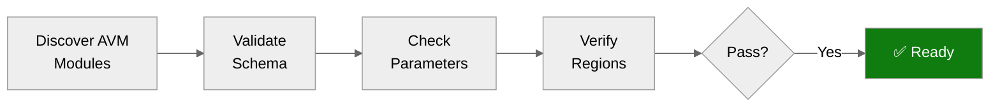

# ✅ Step 4b: Pre-Flight AVM Check - nordic-fresh-foods

<strong>📑 Pre-Flight Contents</strong>

- [🎯 Purpose](#-purpose)
- [✅ AVM Schema Validation Results](#-avm-schema-validation-results)
- [🔎 Parameter Type Analysis](#-parameter-type-analysis)
- [🌍 Region Limitations Identified](#-region-limitations-identified)
- [⚠️ Pitfalls Checklist](#-pitfalls-checklist)
- [🚀 Ready for Implementation](#-ready-for-implementation)

> Generated by bicep-code agent | 2026-03-11
> Status: **PASS**

| ⬅️ Previous                                            | 📑 Index            | Next ➡️                                                          |
| ------------------------------------------------------ | ------------------- | ---------------------------------------------------------------- |
| [04-implementation-plan.md](04-implementation-plan.md) | [README](README.md) | [05-implementation-reference.md](05-implementation-reference.md) |

## 🎯 Purpose

> [!IMPORTANT]
> This checkpoint validates AVM module schemas BEFORE Bicep code generation.

Prevents:

- Parameter type mismatches (string vs int)
- Deprecated parameter usage
- Region availability issues
- Object structure errors

## ✅ AVM Schema Validation Results

| Resource                | AVM Module Path                                      | Version  | Status |
| ----------------------- | ---------------------------------------------------- | -------- | ------ |
| Virtual Network         | `br/public:avm/res/network/virtual-network`          | `0.7.2`  | ✅      |
| Log Analytics Workspace | `br/public:avm/res/operational-insights/workspace`   | `0.15.0` | ✅      |
| Application Insights    | `br/public:avm/res/insights/component`               | `0.7.1`  | ✅      |
| Key Vault               | `br/public:avm/res/key-vault/vault`                  | `0.13.3` | ✅      |
| SQL Server              | `br/public:avm/res/sql/server`                       | `0.21.1` | ✅      |
| Storage Account         | `br/public:avm/res/storage/storage-account`          | `0.32.0` | ✅      |
| Private DNS Zone        | `br/public:avm/res/network/private-dns-zone`         | `0.8.1`  | ✅      |
| Private Endpoint        | `br/public:avm/res/network/private-endpoint`         | `0.12.0` | ✅      |
| App Service Plan        | `br/public:avm/res/web/serverfarm`                   | `0.7.0`  | ✅      |
| App Service             | `br/public:avm/res/web/site`                         | `0.22.0` | ✅      |
| Budget                  | Raw Bicep (`Microsoft.Consumption/budgets`)          | N/A      | ✅      |

**11/11 resources validated** — 10 AVM modules, 1 raw Bicep (budget).

## 🔎 Parameter Type Analysis

<strong>Log Analytics Parameters</strong>

| Parameter      | Expected Type | Actual Type | Fix Applied |
| -------------- | ------------- | ----------- | ----------- |
| `dailyQuotaGb` | `string`      | `int`       | Changed to string literal `'2'` / `'1'` |

<strong>SQL Server Parameters</strong>

| Parameter          | Expected Type | Notes                                    |
| ------------------ | ------------- | ---------------------------------------- |
| `availabilityZone` | `-1 \| int`   | Required on database objects; set to `-1` |
| `diagnosticSettings` | Not allowed at server level | Removed; diagnostics at DB level  |

<strong>App Service Parameters</strong>

| Parameter                        | Expected Name                      | Fix Applied                         |
| -------------------------------- | ---------------------------------- | ----------------------------------- |
| `virtualNetworkSubnetId`         | `virtualNetworkSubnetResourceId`   | Renamed to match AVM schema         |

<strong>Budget Parameters</strong>

| Parameter   | Issue                                   | Fix Applied                          |
| ----------- | --------------------------------------- | ------------------------------------ |
| `utcNow()`  | Cannot be used in variables             | Moved to parameter default value     |

## 🌍 Region Limitations Identified

| Resource                | Region            | Limitation | Status |
| ----------------------- | ----------------- | ---------- | ------ |
| All planned resources   | `swedencentral`   | None       | ✅      |

No region restrictions apply to the planned resource set.

## ⚠️ Pitfalls Checklist

- [x] AVM versions pinned on all module references
- [x] `dailyQuotaGb` passed as string (not int) to Log Analytics AVM
- [x] SQL database object includes `availabilityZone: -1`
- [x] SQL Server `diagnosticSettings` removed from server params (not supported)
- [x] App Service uses `virtualNetworkSubnetResourceId` (not `virtualNetworkSubnetId`)
- [x] `utcNow()` only used as parameter default value (not in variables)
- [x] Role assignment names use `guid()` with deterministic inputs (no runtime outputs)
- [x] `last(split(...))!` used for existing resource name extraction (non-null assertion)
- [x] Tags passed as complete object to all AVM modules

## 🚀 Ready for Implementation

**Verdict: PASS** — All 11 resources validated against AVM schemas. 5 parameter type mismatches found and corrected during preflight. No blockers remain.
