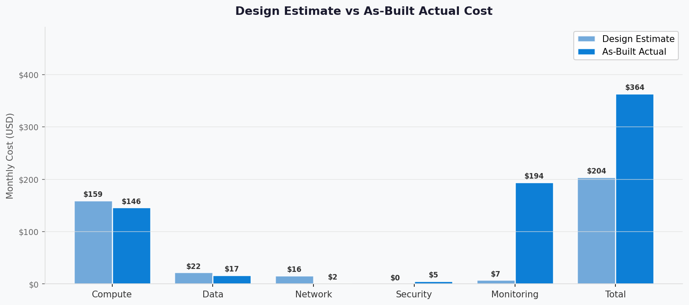
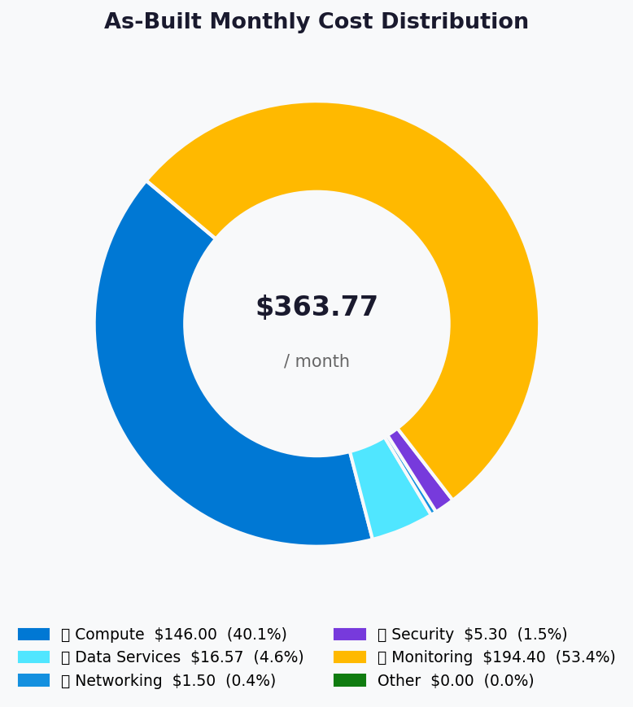
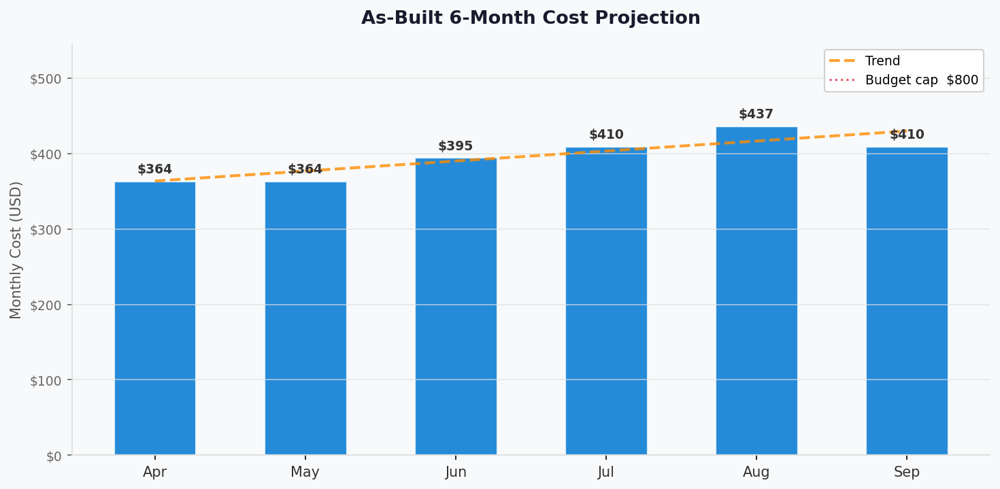

# 💰 As-Built Cost Estimate: nordic-fresh-foods


<details open>
<summary><strong>📑 As-Built Cost Contents</strong></summary>

- [💵 Cost At-a-Glance](#-cost-at-a-glance)
- [✅ Decision Summary](#-decision-summary)
- [🔁 Requirements → Cost Mapping](#-requirements--cost-mapping)
- [📊 Top 5 Cost Drivers](#-top-5-cost-drivers)
- [🏛️ Architecture Overview](#%EF%B8%8F-architecture-overview)
- [🧾 What We Are Not Paying For (Yet)](#-what-we-are-not-paying-for-yet)
- [⚠️ Cost Risk Indicators](#%EF%B8%8F-cost-risk-indicators)
- [🎯 Quick Decision Matrix](#-quick-decision-matrix)
- [💰 Savings Opportunities](#-savings-opportunities)
- [🧾 Detailed Cost Breakdown](#-detailed-cost-breakdown)
- [References](#references)

</details>

> Generated by 08-As-Built agent | 2026-03-11

<div align="center">

| ⬅️ Previous                                        | 📑 Index            | Next ➡️ |
| -------------------------------------------------- | ------------------- | ------- |
| [07-compliance-matrix.md](07-compliance-matrix.md) | [README](README.md) | —       |

</div>

**Generated**: 2026-03-11
**Source**: Deployed resources + `cost-estimate-subagent` MCP pricing response
**Region**: swedencentral
**Environment**: Production
**MCP Tools Used**: `azure_bulk_estimate`, `azure_cost_estimate`, `azure_price_search`, `azure_sku_discovery` (via subagent)
**IaC Reference**: [infra/bicep/nordic-fresh-foods/](../../infra/bicep/nordic-fresh-foods/)

## 💵 Cost At-a-Glance

> **Monthly Total: $363.77** | Annual: $4,365.24
>
> ```text
> Budget: $800/month (resource-group budget) | Utilization: 45.47% ($363.77 of $800)
> ```
>
> | Status | Indicator |
> | ------ | --------- |
> | Cost Trend | ➡️ Stable (monitoring-heavy profile) |
> | Savings Available | 💰 Potential with monitoring ingestion tuning |
> | Compliance | ✅ GDPR and PCI-DSS aligned controls deployed |

## ✅ Decision Summary

- ✅ Implemented: App Service S1 (2 instances), SQL S0, private endpoints (3), Key Vault Premium, Storage LRS, monitoring stack, budget alerts.
- ⏳ Deferred: WAF/Application Gateway, DDoS Standard, multi-region active-passive architecture.
- 🔁 Redesign Trigger: Sustained 3-instance runtime plus high telemetry ingestion pushes total toward budget threshold.

**Confidence**: Medium | **Expected Variance**: +/-20% (telemetry ingestion and unresolved PE meter are primary variables)

### Design vs As-Built Summary

| Metric | Design Estimate | As-Built | Variance | Status |
| ------ | --------------- | -------- | -------- | ------ |
| Monthly Estimate | $203.97 | $363.77 | +$159.80 | ⚠️ |
| Annual Estimate | $2,447.64 | $4,365.24 | +$1,917.60 | ⚠️ |



## 🔁 Requirements → Cost Mapping

| Requirement | Architecture Decision | Cost Impact | Mandatory |
| ----------- | --------------------- | ----------- | --------- |
| SLA 99.9% | S1 App Service with min 2 instances | +$146.00/month | Yes |
| GDPR/PCI network isolation | 3 Private Endpoints + 3 Private DNS zones | +$1.50/month in current priced output (PE unresolved) | Yes |
| Relational transaction store | SQL S0 single database | +$14.71/month | Yes |
| Observability baseline | Log Analytics + App Insights | +$194.40/month | Yes |

## 📊 Top 5 Cost Drivers

| Rank | Resource | Monthly Cost | % of Total | Trend | Optimization |
| ---- | -------- | ------------ | ---------- | ----- | ------------ |
| 1️⃣ | Log Analytics ingestion | $179.40 | 49.32% | ⬆️ | Reduce ingestion volume and noisy logs |
| 2️⃣ | App Service Plan S1 x2 | $146.00 | 40.13% | ➡️ | Validate sustained capacity requirement |
| 3️⃣ | Application Insights | $15.00 | 4.12% | ➡️ | Sampling/retention tuning |
| 4️⃣ | SQL Database S0 | $14.71 | 4.04% | ➡️ | Keep S0 until sustained pressure |
| 5️⃣ | Key Vault Premium | $5.30 | 1.46% | ➡️ | Right-size ops and vault SKU if allowable |

> 💡 **Quick Win**: Prioritize telemetry filtering and ingestion caps; this has the largest single cost-reduction potential.

<details>
<summary><strong>Cost Driver Details</strong></summary>

#### 1️⃣ Monitoring Stack

| Aspect | Detail |
| ------ | ------ |
| Current Inputs | Log Analytics estimated at 2 GB/day and App Insights workspace-based |
| Monthly Cost | $194.40 |
| Optimization | Refine data collection and reduce high-cardinality telemetry |
| Potential Savings | Significant, workload-dependent |

</details>

## 🏛️ Architecture Overview

### Cost Distribution

| Category | Monthly Cost (USD) | Share |
| -------- | -----------------: | ----: |
| 💻 Compute | 146.00 | 40.13% |
| 💾 Data Services | 16.57 | 4.56% |
| 🌐 Networking | 1.50 | 0.41% |
| 🔐 Security | 5.30 | 1.46% |
| 📊 Monitoring | 194.40 | 53.45% |
| Other | 0.00 | 0.00% |



### Month-over-Month Projection



### Key Design Decisions Affecting Cost

| Decision | Cost Impact | Business Rationale | Status |
| -------- | ----------- | ------------------ | ------ |
| Min 2 App Service instances | +$146.00/month | Availability and peak readiness | Required |
| Telemetry cap + workspace monitor | +$194.40/month in current estimate | Operational visibility | Required |
| SQL S0 baseline | +$14.71/month | MVP transactional requirements | Required |

## 🧾 What We Are Not Paying For (Yet)

- Azure WAF/Application Gateway v2
- Azure DDoS Protection Standard
- Multi-region active-passive duplicate stack
- Redis cache tier

## ⚠️ Cost Risk Indicators

| Resource | Risk Level | Issue | Mitigation |
| -------- | ---------- | ----- | ---------- |
| Log Analytics | 🔴 High | Ingestion estimate dominates monthly spend | Reduce ingestion and tune diagnostic categories |
| Private Endpoints | 🟡 Medium | Region meter unresolved in pricing tool | Re-check meter mapping in next cost cycle |
| App Service Plan | 🟡 Medium | Scale-to-3 scenarios increase compute by $73.00 | Track autoscale events and seasonal run rate |

> **⚠️ Watch Item**: Monitoring assumptions currently drive the delta versus design estimate.

## 🎯 Quick Decision Matrix

_"If you need X, expect to pay Y more"_

| Requirement | Additional Cost | SKU Change | Verdict | Notes |
| ----------- | --------------- | ---------- | ------- | ----- |
| Seasonal scale-to-3 | +$73.00/month | S1 instances 2 -> 3 | 🟢 Go | Included in autoscale profile |
| Full WAF tier | Not in current as-built | Add App Gateway WAF_v2 | 🟡 Monitor | Evaluate post-MVP |
| Multi-region DR | Not in current as-built | Duplicate stack in failover region | 🔴 Investigate | Budget impact likely material |

## 💰 Savings Opportunities

> ### Total Potential Savings: Variable (telemetry and retention tuning dependent)
>
> | Strategy | Commitment | Monthly Savings | Annual Savings | % Reduction |
> | -------- | ---------- | --------------- | -------------- | ----------- |
> | Log filtering + category tuning | N/A | Variable | Variable | Variable |
> | App Insights ingestion tuning | N/A | Variable | Variable | Variable |
> | Planned peak-window scaling only | N/A | Up to $73 in non-peak periods | Up to $876 | 20.07% |

## 🧾 Detailed Cost Breakdown

### IaC / Pricing Coverage

| Signal | Value | Status |
| ------ | ----- | ------ |
| Templates scanned | 9 Bicep files | ✅ |
| Resources detected | 24 as-built resources | ✅ |
| Resources priced | 10 primary billable meters | ✅ |
| Unpriced resources | Private Endpoint meter unresolved in tool output | ⚠️ |

### Line Items

| Category | Service | SKU / Meter | Quantity / Units | Est. Monthly |
| -------- | ------- | ----------- | ---------------- | ------------ |
| 💻 Compute | App Service Plan | S1 Linux | 2 instances x 730h | $146.00 |
| 💻 Compute | App Service Site | Plan-backed | 1 | $0.00 |
| 💾 Data Services | Azure SQL DB | S0 | 1 database | $14.71 |
| 💾 Data Services | Storage (Hot LRS + txns) | Blob + transactions | 50 GB + 100K txns | $1.86 |
| 🔐 Security | Key Vault Premium | Base + ops | 1 vault + 100K ops | $5.30 |
| 🌐 Networking | Private DNS Zones | Private DNS | 3 zones | $1.50 |
| 🌐 Networking | Private Endpoints | PE meter | 3 endpoints | $0.00 (unresolved) |
| 📊 Monitoring | Log Analytics | Analytics Logs | 2 GB/day (~60 GB/mo) | $179.40 |
| 📊 Monitoring | Application Insights | Enterprise meter | 1 component | $15.00 |
| Other | Budget, NSGs, VNet, NICs, autoscale | N/A | N/A | $0.00 |

### Notes

- All dollar figures above are from `cost-estimate-subagent` output and were not manually adjusted.
- The Private Endpoint meter did not resolve for `swedencentral` in the subagent output.
- Design estimate from Step 3 used lower monitoring assumptions, causing the main variance.

---

## References

| Topic | Link |
| ----- | ---- |
| Azure Pricing Calculator | [Calculator](https://azure.microsoft.com/pricing/calculator/) |
| Cost Management | [Overview](https://learn.microsoft.com/azure/cost-management-billing/costs/overview-cost-management) |
| Reserved Instances | [Reservations](https://learn.microsoft.com/azure/cost-management-billing/reservations/save-compute-costs-reservations) |
| WAF Cost Optimization | [Checklist](https://learn.microsoft.com/azure/well-architected/cost-optimization/checklist) |

---

<div align="center">

| ⬅️ [07-compliance-matrix.md](07-compliance-matrix.md) | 🏠 [Project Index](README.md) | ➡️ — |
| ----------------------------------------------------- | ----------------------------- | ---- |

</div>
