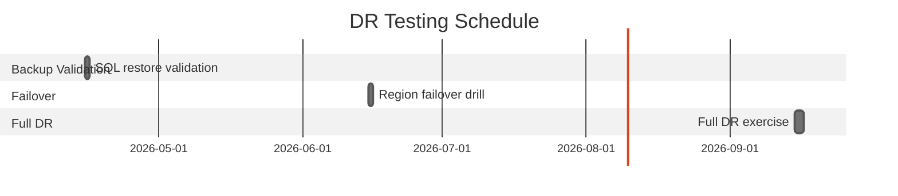

# 🛡️ Backup and Disaster Recovery Plan: nordic-fresh-foods


<details open>
<summary><strong>📑 DR Plan Contents</strong></summary>

- [📋 Executive Summary](#-executive-summary)
- [🎯 1. Recovery Objectives](#-1-recovery-objectives)
- [💾 2. Backup Strategy](#-2-backup-strategy)
- [🌍 3. Disaster Recovery Procedures](#-3-disaster-recovery-procedures)
- [🧪 4. Testing Schedule](#-4-testing-schedule)
- [📢 5. Communication Plan](#-5-communication-plan)
- [👥 6. Roles and Responsibilities](#-6-roles-and-responsibilities)
- [🔗 7. Dependencies](#-7-dependencies)
- [📖 8. Recovery Runbooks](#-8-recovery-runbooks)
- [📎 9. Appendix](#-9-appendix)
- [References](#references)

</details>

> Generated by 08-As-Built agent | 2026-03-11

<div align="center">

| ⬅️ Previous                                          | 📑 Index            | Next ➡️                                            |
| ---------------------------------------------------- | ------------------- | -------------------------------------------------- |
| [07-resource-inventory.md](07-resource-inventory.md) | [README](README.md) | [07-compliance-matrix.md](07-compliance-matrix.md) |

</div>

**Generated**: 2026-03-11
**Version**: 1.0
**Environment**: prod
**Primary Region**: swedencentral
**Secondary Region**: germanywestcentral (planned failover target)

---

## 📋 Executive Summary

> [!IMPORTANT]
> This document defines the backup strategy and disaster recovery procedures for nordic-fresh-foods.

| Metric           | Current                                                                      | Target   |
| ---------------- | ---------------------------------------------------------------------------- | -------- |
| **RPO**          | SQL: service-managed PITR window; app data: daily operational backup pattern | 12 hours |
| **RTO**          | Manual failover + redeploy strategy                                          | 24 hours |
| **Availability** | Single-region with autoscale                                                 | 99.9%    |

---

## 🎯 1. Recovery Objectives

### 1.1 Recovery Time Objective (RTO)

| Tier         | RTO Target | Services                               |
| ------------ | ---------- | -------------------------------------- |
| 🔴 Critical  | 4-8 hours  | App Service, SQL database, Key Vault   |
| 🟠 Important | 8-16 hours | Storage assets, DNS private resolution |
| 🟢 Standard  | 24 hours   | Monitoring, non-critical integrations  |

### 1.2 Recovery Point Objective (RPO)

| Data Type                | RPO Target  | Backup Strategy                                     |
| ------------------------ | ----------- | --------------------------------------------------- |
| Transactional data (SQL) | <= 12 hours | SQL automated backups + PITR                        |
| Blob assets              | <= 24 hours | Export/snapshot operational process                 |
| Secrets/config           | <= 24 hours | Key Vault recoverable soft-delete + IaC rehydration |

```mermaid
%%{init: {'theme':'neutral'}}%%
gantt
    title RPO / RTO Targets by Tier
    dateFormat HH:mm
    axisFormat %H:%M
    section Critical
        RPO :crit, rpo1, 00:00, 12h
        RTO :crit, rto1, 00:00, 8h
    section Important
        RPO :rpo2, 00:00, 24h
        RTO :rto2, 00:00, 16h
    section Standard
        RPO :rpo3, 00:00, 24h
        RTO :rto3, 00:00, 24h
```



---

## 💾 2. Backup Strategy

<details>
<summary><strong>💾 Azure SQL Database</strong></summary>

| Setting             | Configuration                         |
| ------------------- | ------------------------------------- |
| Backup Type         | Platform-managed automated backups    |
| Retention (PITR)    | Service default for S0 tier           |
| Long-Term Retention | Not configured in current deployment  |
| Geo-Redundancy      | Not enabled (local backup redundancy) |

**Point-in-Time Restore Command:**

```bash
az sql db restore \
  --resource-group rg-nordic-fresh-foods-prod \
  --server sql-nordic-fresh-foods-prod \
  --name sqldb-freshconnect-prod \
  --dest-name sqldb-freshconnect-prod-restored \
  --time "2026-03-11T17:00:00Z"
```

</details>

<details>
<summary><strong>🔐 Azure Key Vault</strong></summary>

| Setting          | Configuration |
| ---------------- | ------------- |
| Soft Delete      | Enabled       |
| Purge Protection | Enabled       |

</details>

---

## 🌍 3. Disaster Recovery Procedures

<details>
<summary><strong>🌍 Region Failover</strong></summary>

### 3.1 Failover Procedure

1. Confirm incident severity and regional impact in Azure Service Health.
2. Restore SQL database to failover region (manual geo-restore or latest available backup path).
3. Re-deploy stack from `infra/bicep/nordic-fresh-foods/` with failover region parameters.
4. Rehydrate Key Vault secrets and validate managed identity permissions.
5. Update DNS/app endpoint routing to failover deployment.
6. Execute smoke tests and release service.

</details>

<details>
<summary><strong>↩️ Failback Procedure</strong></summary>

### 3.2 Failback Procedure

1. Validate primary region recovery.
2. Synchronize latest data back to primary environment.
3. Re-deploy primary resources from IaC.
4. Switch traffic back during approved maintenance window.
5. Run post-failback validation and close incident.

</details>

---

## 🧪 4. Testing Schedule

| Test Type                         | Frequency   | Last Test    | Next Test |
| --------------------------------- | ----------- | ------------ | --------- |
| SQL PITR restore test             | Quarterly   | Not recorded | 2026-Q2   |
| Private endpoint + DNS validation | Quarterly   | Not recorded | 2026-Q2   |
| Full tabletop DR exercise         | Semi-annual | Not recorded | 2026-Q3   |



---

## 📢 5. Communication Plan

| Audience             | Channel       | Template                              |
| -------------------- | ------------- | ------------------------------------- |
| Engineering on-call  | Teams + Pager | P1/P2 incident template               |
| Product stakeholders | Teams + Email | Service disruption notice             |
| Compliance contacts  | Email         | Security/compliance incident template |

---

## 👥 6. Roles and Responsibilities

| Role                      | Team                | Responsibility                                      |
| ------------------------- | ------------------- | --------------------------------------------------- |
| Incident Commander        | SRE lead            | Owns incident bridge, decisions, and communications |
| Database Recovery Lead    | Data platform       | Executes SQL restore/failover tasks                 |
| Application Recovery Lead | App engineering     | Re-deploys and validates application tier           |
| Security Lead             | Security/compliance | Verifies IAM, key access, and audit integrity       |

---

## 🔗 7. Dependencies

| Dependency                       | Impact                                   | Mitigation                                      |
| -------------------------------- | ---------------------------------------- | ----------------------------------------------- |
| Azure SQL restore availability   | Critical path for transactional recovery | Pre-tested restore runbooks and periodic drills |
| Private DNS resolution           | App-to-data connectivity                 | Validate DNS links in every DR test             |
| External payment/maps/email APIs | Functional degradation if unavailable    | Circuit breaker + degraded mode behavior        |

---

## 📖 8. Recovery Runbooks

| Scenario            | Runbook                                    | Owner                  |
| ------------------- | ------------------------------------------ | ---------------------- |
| SQL data corruption | SQL PITR and app rebind                    | Database Recovery Lead |
| Region outage       | Secondary region redeploy + traffic switch | Incident Commander     |
| Secret compromise   | Key rotation + app restart + audit         | Security Lead          |

<details>
<summary><strong>📖 Runbook: SQL PITR Recovery</strong></summary>

**Trigger**: Data corruption or accidental destructive write.
**Estimated Duration**: 1-3 hours.

1. Identify last known good restore point.
2. Run `az sql db restore` to a new database name.
3. Validate schema/data and update application connection reference.
4. Restart app and run transactional smoke tests.

**Validation**:

```bash
az sql db show \
  --resource-group rg-nordic-fresh-foods-prod \
  --server sql-nordic-fresh-foods-prod \
  --name sqldb-freshconnect-prod
```

</details>

---

## 📎 9. Appendix

<details>
<summary>📋 Detailed Recovery Procedures</summary>

- App hostname: `app-nordic-fresh-foods-prod-7jrcjf.azurewebsites.net`
- SQL FQDN: `sql-nordic-fresh-foods-prod.database.windows.net`
- Key Vault URI: `https://kv-nff-prod-7jrcjfo3iqck.vault.azure.net/`
- Storage endpoint: `https://stnffprod7jrcjfo3iqckk.blob.core.windows.net/`

</details>

---

## References

> [!NOTE]
> 📚 The following Microsoft Learn resources provide DR guidance.

| Topic                 | Link                                                                                            |
| --------------------- | ----------------------------------------------------------------------------------------------- |
| Azure Backup Overview | [Backup Overview](https://learn.microsoft.com/azure/backup/backup-overview)                     |
| Backup Best Practices | [Best Practices](https://learn.microsoft.com/azure/backup/backup-best-practices)                |
| RTO/RPO Guidance      | [Reliability Metrics](https://learn.microsoft.com/azure/well-architected/reliability/metrics)   |
| Site Recovery         | [ASR Overview](https://learn.microsoft.com/azure/site-recovery/site-recovery-overview)          |
| Business Continuity   | [DR Planning](https://learn.microsoft.com/azure/well-architected/reliability/disaster-recovery) |

---

_Backup and DR plan generated from infrastructure artifacts._

---

<div align="center">

| ⬅️ [07-resource-inventory.md](07-resource-inventory.md) | 🏠 [Project Index](README.md) | ➡️ [07-compliance-matrix.md](07-compliance-matrix.md) |
| ------------------------------------------------------- | ----------------------------- | ----------------------------------------------------- |

</div>
