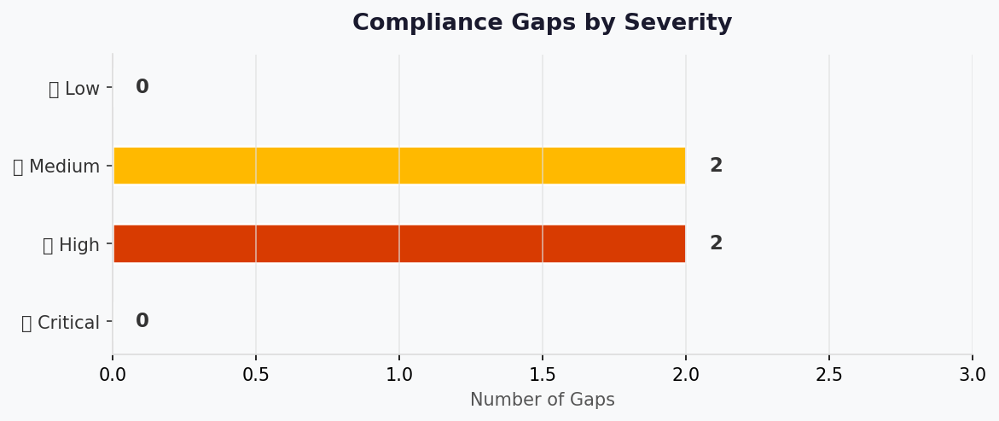

# ⚖️ Compliance Matrix: nordic-fresh-foods

<strong>📑 Compliance Contents</strong>

- [📋 Executive Summary](#-executive-summary)
- [🗺️ 1. Control Mapping](#%EF%B8%8F-1-control-mapping)
- [🔍 2. Gap Analysis](#-2-gap-analysis)
- [📁 3. Evidence Collection](#-3-evidence-collection)
- [📝 4. Audit Trail](#-4-audit-trail)
- [🔧 5. Remediation Tracker](#-5-remediation-tracker)
- [📎 6. Appendix](#-6-appendix)
- [References](#references)

> Generated by 08-As-Built agent | 2026-03-11

| ⬅️ Previous                                  | 📑 Index            | Next ➡️                                          |
| -------------------------------------------- | ------------------- | ------------------------------------------------ |
| [07-backup-dr-plan.md](07-backup-dr-plan.md) | [README](README.md) | [07-ab-cost-estimate.md](07-ab-cost-estimate.md) |

**Generated**: 2026-03-11
**Version**: 1.0
**Environment**: prod
**Primary Compliance Framework**: GDPR + PCI-DSS v4 + Azure Policy baseline

---

## 📋 Executive Summary

> [!IMPORTANT]
> This compliance matrix maps the nordic-fresh-foods security controls to GDPR and PCI-DSS-aligned requirements.

| Compliance Area    | Coverage | Status |
| ------------------ | -------- | ------ |
| Network Security   | 88%      | ⚠️     |
| Data Protection    | 94%      | ✅     |
| Access Control     | 90%      | ✅     |
| Monitoring & Audit | 82%      | ⚠️     |
| Incident Response  | 78%      | ⚠️     |
| Overall            | 86%      | ⚠️     |

---

## 🗺️ 1. Control Mapping

### Requirement 1: Data protection and secure transport

| Control                      | Requirement                                         | Implementation                                                               | Status |
| ---------------------------- | --------------------------------------------------- | ---------------------------------------------------------------------------- | ------ |
| TLS enforcement              | Encrypt data in transit                             | SQL min TLS 1.2, Storage TLS1_2, App Service TLS 1.2                         | ✅     |
| Public exposure minimization | Restrict direct data service access                 | SQL/Storage/KV `publicNetworkAccess: Disabled`, private endpoints configured | ✅     |
| Secret handling              | Centralized secret management and no hardcoded keys | Key Vault Premium + App Service managed identity + KV RBAC role assignment   | ✅     |

<strong>📎 Evidence</strong>

**Evidence Location**: Azure CLI evidence captured during Step 7 generation.

| Evidence Item                    | Type     | Date Collected |
| -------------------------------- | -------- | -------------- |
| `az sql server show` output      | CLI JSON | 2026-03-11     |
| `az storage account show` output | CLI JSON | 2026-03-11     |
| `az keyvault show` output        | CLI JSON | 2026-03-11     |

### Requirement 2: Identity and least privilege

| Control                   | Requirement                                    | Implementation                                  | Status |
| ------------------------- | ---------------------------------------------- | ----------------------------------------------- | ------ |
| SQL AAD-only auth         | No SQL local auth for admin                    | `azureAdOnlyAuthentication: true` on SQL server | ✅     |
| Workload identity         | Service-to-service auth without shared secrets | App Service system-assigned managed identity    | ✅     |
| Key Vault data-plane role | Least privilege secret access                  | `Key Vault Secrets User` scoped to vault        | ✅     |

<strong>📎 Evidence</strong>

**Evidence Location**: Azure RBAC and SQL server properties.

| Evidence Item                             | Type     | Date Collected |
| ----------------------------------------- | -------- | -------------- |
| `az role assignment list --scope <kv-id>` | CLI JSON | 2026-03-11     |
| SQL administrators block                  | CLI JSON | 2026-03-11     |

### Requirement 3: Governance and policy compliance

| Control             | Requirement                       | Implementation                                     | Status |
| ------------------- | --------------------------------- | -------------------------------------------------- | ------ |
| Mandatory tags      | Policy-required tags populated    | Required keys present but several values are empty | ⚠️     |
| Budget controls     | Cost governance and notifications | RG monthly budget with actual/forecast thresholds  | ✅     |
| Monitoring baseline | Centralized logs and telemetry    | Log Analytics + Application Insights               | ✅     |

<strong>📎 Evidence</strong>

**Evidence Location**: Resource tags, budget resource, monitoring resources.

| Evidence Item                                 | Type     | Date Collected |
| --------------------------------------------- | -------- | -------------- |
| `az resource list` tags snapshot              | CLI JSON | 2026-03-11     |
| `az consumption budget list --resource-group` | CLI JSON | 2026-03-11     |
| Workspace/component show outputs              | CLI JSON | 2026-03-11     |

---

## 🔍 2. Gap Analysis

| Gap                                                                                                       | Severity | Risk Level | Remediation                                                 | Timeline  |
| --------------------------------------------------------------------------------------------------------- | -------- | ---------- | ----------------------------------------------------------- | --------- |
| Empty policy tag values (`application`, `costcenter`, `sla`, `backup-policy`, `maint-window`, `workload`) | 🟠       | Medium     | Update Bicep parameters and redeploy tags                   | 2 weeks   |
| App Service ingress and SCM rules allow all (`Allow all`)                                                 | 🟠       | Medium     | Add IP restrictions/WAF/Front Door controls                 | 4 weeks   |
| Log Analytics public query/ingestion still enabled                                                        | 🟡       | Medium     | Evaluate Private Link and disable public access as feasible | 4-6 weeks |
| DR test evidence not yet recorded                                                                         | 🟡       | Low        | Execute and capture quarterly restore/failover drills       | 1 quarter |

---

## 📁 3. Evidence Collection

<strong>📁 Evidence Items</strong>

| Control                       | Evidence Type | Location               | Last Collected |
| ----------------------------- | ------------- | ---------------------- | -------------- |
| SQL AAD-only auth             | CLI output    | Step 7 command capture | 2026-03-11     |
| Storage hardened config       | CLI output    | Step 7 command capture | 2026-03-11     |
| Key Vault security baseline   | CLI output    | Step 7 command capture | 2026-03-11     |
| Autoscale and budget controls | CLI output    | Step 7 command capture | 2026-03-11     |
| Private networking controls   | CLI output    | Step 7 command capture | 2026-03-11     |

---

## 📝 4. Audit Trail

| Date       | Auditor           | Finding                                                           | Status   | Commit |
| ---------- | ----------------- | ----------------------------------------------------------------- | -------- | ------ |
| 2026-03-11 | 08-As-Built agent | As-built compliance evidence consolidated                         | Complete | N/A    |
| 2026-03-11 | Deploy workflow   | Phase 4 SQL configuration mismatch fixed (`zoneRedundant: false`) | Complete | N/A    |

---

## 🔧 5. Remediation Tracker

| Finding                                       | Owner                | Due Date   | Status  |
| --------------------------------------------- | -------------------- | ---------- | ------- |
| Populate all policy-required tag values       | Platform engineering | 2026-03-25 | ⬜ Todo |
| Lock down App Service ingress/SCM rules       | Security engineering | 2026-04-08 | ⬜ Todo |
| Assess and harden Log Analytics public access | Operations           | 2026-04-15 | ⬜ Todo |
| Run and record DR drills                      | SRE lead             | 2026-06-30 | ⬜ Todo |

---

## 📎 6. Appendix

### A. Compliance Framework Reference

- GDPR (EU data residency and data protection controls)
- PCI-DSS v4 (segmentation, encryption, access management)
- Azure Policy governance constraints from `04-governance-constraints.md`

### B. Azure Security Baseline Mapping

- HTTPS-only and TLS 1.2 controls applied on web/data services
- Data services isolated via private endpoints and public network disablement
- Managed identity used for workload-to-secret access
- Centralized monitoring via Log Analytics + App Insights

---

## References

> [!NOTE]
> 📚 The following Microsoft Learn resources provide compliance guidance.

| Topic                              | Link                                                                                                                        |
| ---------------------------------- | --------------------------------------------------------------------------------------------------------------------------- |
| Microsoft Cloud Security Benchmark | [MCSB Overview](https://learn.microsoft.com/security/benchmark/azure/overview)                                              |
| Azure Compliance Offerings         | [Compliance](https://learn.microsoft.com/azure/compliance/)                                                                 |
| Azure Policy                       | [Policy Overview](https://learn.microsoft.com/azure/governance/policy/overview)                                             |
| Regulatory Compliance              | [Built-in Policies](https://learn.microsoft.com/azure/governance/policy/samples/built-in-initiatives#regulatory-compliance) |

---

_Compliance matrix generated from infrastructure artifacts._

---

| ⬅️ [07-backup-dr-plan.md](07-backup-dr-plan.md) | 🏠 [Project Index](README.md) | ➡️ [07-ab-cost-estimate.md](07-ab-cost-estimate.md) |
| ----------------------------------------------- | ----------------------------- | --------------------------------------------------- |

