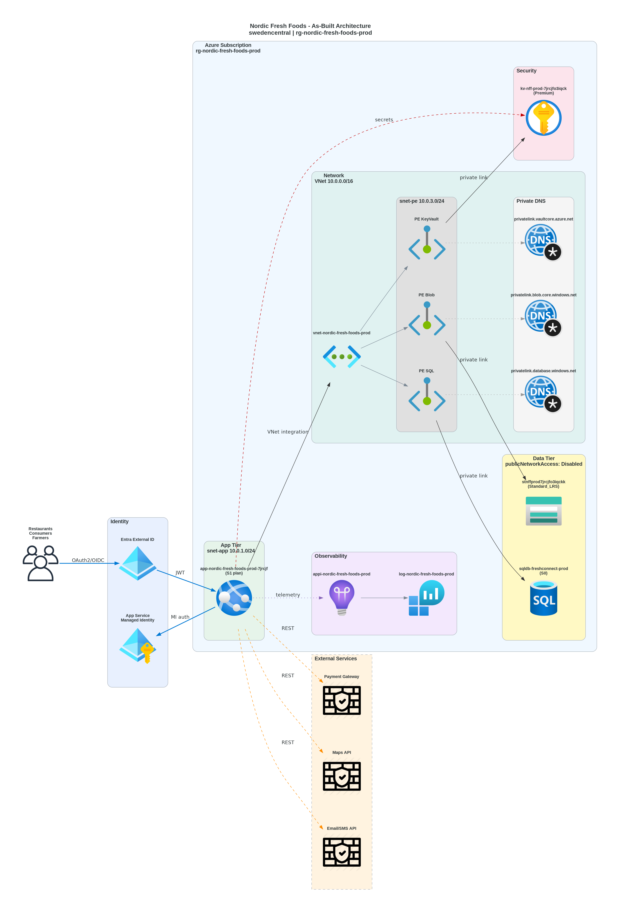

# 📐 Azure Design Document: nordic-fresh-foods

<strong>📑 Design Contents</strong>

- [📝 1. Introduction](#-1-introduction)
- [🏛️ 2. Azure Architecture Overview](#-2-azure-architecture-overview)
- [🌐 3. Networking](#-3-networking)
- [💾 4. Storage](#-4-storage)
- [💻 5. Compute](#-5-compute)
- [👤 6. Identity & Access](#-6-identity--access)
- [🔐 7. Security & Compliance](#-7-security--compliance)
- [🔄 8. Backup & Disaster Recovery](#-8-backup--disaster-recovery)
- [📊 9. Management & Monitoring](#-9-management--monitoring)
- [📎 10. Appendix](#-10-appendix)
- [References](#references)

> Generated by 08-As-Built agent | 2026-03-11

| ⬅️ Previous                                            | 📑 Index            | Next ➡️                                              |
| ------------------------------------------------------ | ------------------- | ---------------------------------------------------- |
| [07-documentation-index.md](07-documentation-index.md) | [README](README.md) | [07-operations-runbook.md](07-operations-runbook.md) |

**Version**: 1.0
**Date**: 2026-03-11
**Author**: Generated by Workload Documentation Generator
**Status**: Complete

---

## 📝 1. Introduction

### 1.1 Document Purpose

This as-built design document captures the actual Azure deployment state for the FreshConnect MVP workload after successful Step 6 deployment.

**Intended Audience:**

- Solution Architects
- Operations/SRE Teams
- Security & Compliance Teams
- Development Teams

### 1.2 Project Overview

Cloud-based farm-to-table ordering platform connecting farms, restaurants, and consumers across Scandinavia. Deployed as a cost-optimized N-tier web application in `swedencentral` with private data access paths for SQL, Storage, and Key Vault.

**Business Objectives:**

- Reduce order errors to below 1%
- Enable near-real-time order and inventory processing
- Maintain GDPR and PCI-DSS aligned security controls under startup budget

### 1.3 Design Objectives

| Objective    | Target                               | Implementation                                                                              |
| ------------ | ------------------------------------ | ------------------------------------------------------------------------------------------- |
| Availability | 99.9%                                | App Service Standard S1 with autoscale min 2, max 3                                         |
| Performance  | p95 API < 500 ms                     | Co-located App Service + SQL in Sweden Central, S0 SQL baseline                             |
| Security     | Private data paths, no secret sprawl | Key Vault + Managed Identity + private endpoints + public network disabled on data services |
| Scalability  | 3x seasonal traffic                  | CPU autoscale policy 70% up / 30% down                                                      |

### 1.4 Constraints & Assumptions

**Constraints:**

- Budget ceiling around EUR 1,000/month
- EU data residency and policy-enforced tagging

**Assumptions:**

- Workload remains single-region for MVP
- Payment provider remains tokenized/redirect model (no CHD in Azure estate)

### 1.5 Stakeholders

| Role                  | Team                           | Responsibility                            |
| --------------------- | ------------------------------ | ----------------------------------------- |
| Platform Owner        | Nordic Fresh Foods Engineering | Product and platform ownership            |
| Operations            | InfraOps / SRE                 | Runtime operations and incident response  |
| Security & Compliance | Governance + Security          | PCI/GDPR control evidence and remediation |

---

## 🏛️ 2. Azure Architecture Overview

### 2.1 Architecture Diagram

Source: [07-ab-diagram.py](./07-ab-diagram.py)

### 2.2 Resource Summary

| Category   | Count |
| ---------- | ----- |
| Compute    | 3     |
| Networking | 13    |
| Data       | 6     |
| Security   | 1     |

---

## 🌐 3. Networking

The workload uses a single VNet (`10.0.0.0/16`) with 3 subnets:

- `snet-app` (`10.0.1.0/24`) delegated to `Microsoft.Web/serverFarms`
- `snet-data` (`10.0.2.0/24`) reserved for data tier
- `snet-pe` (`10.0.3.0/24`) for private endpoints (SQL, Blob, Key Vault)

Private DNS zones are linked to the VNet:

- `privatelink.database.windows.net`
- `privatelink.blob.core.windows.net`
- `privatelink.vaultcore.azure.net`

Public network access is disabled for SQL Server, Storage Account, and Key Vault. App Service remains public (`azurewebsites.net`) with HTTPS-only.

---

## 💾 4. Storage

Storage account `stnffprod7jrcjfo3iqckk` is deployed as `StorageV2` with `Standard_LRS`.

Key configuration:

- `enableHttpsTrafficOnly: true`
- `minimumTlsVersion: TLS1_2`
- `allowBlobPublicAccess: false`
- `allowSharedKeyAccess: false`
- `publicNetworkAccess: Disabled`
- Network default action: `Deny`

Blob containers listed in deployment summary: `assets`, `product-images`.

---

## 💻 5. Compute

Compute tier consists of:

- App Service Plan `asp-nordic-fresh-foods-prod` (Linux S1, capacity 2)
- Web App `app-nordic-fresh-foods-prod-7jrcjf` (state: Running)
- Autoscale `autoscale-asp-nordic-fresh-foods-prod` (2-3 instances)

Operational compute settings observed:

- `httpsOnly: true`
- `ftpsState: Disabled`
- `minTlsVersion: 1.2`
- System-assigned managed identity enabled
- VNet integration to `snet-app`

---

## 👤 6. Identity & Access

Identity model:

- User identity: Microsoft Entra External ID (application-level auth)
- Workload identity: System-assigned managed identity on App Service
- SQL admin: Entra group (`nordic-foods-dba`), Azure AD-only authentication enabled

RBAC evidence:

- App Service managed identity granted `Key Vault Secrets User` on Key Vault scope.

---

## 🔐 7. Security & Compliance

<strong>🔒 Security Controls</strong>

| Control           | Implementation                                            | Evidence                                                          |
| ----------------- | --------------------------------------------------------- | ----------------------------------------------------------------- |
| TLS 1.2+          | SQL min TLS 1.2, Storage TLS 1.2, Web App TLS 1.2         | `az sql server show`, `az storage account show`, `az webapp show` |
| HTTPS-only        | Web App + Storage                                         | `httpsOnly: true`, `enableHttpsTrafficOnly: true`                 |
| Managed Identity  | App Service system-assigned identity                      | App Service principal ID `24cd6768-7247-43ac-a1d2-9a7f22000a40`   |
| Network isolation | SQL/Storage/KV public access disabled + private endpoints | 3 private endpoints + 3 private DNS zones                         |

<strong>📋 Compliance Mapping</strong>

| Framework    | Control ID                           | Status |
| ------------ | ------------------------------------ | ------ |
| GDPR         | Data residency + access controls     | ✅     |
| PCI-DSS v4   | Segmentation + encryption in transit | ✅     |
| Azure Policy | Required tags + SQL AAD-only auth    | ✅     |

Open compliance risks:

- Several policy tags (`application`, `costcenter`, `backup-policy`, `maint-window`, `sla`, `workload`) are present but empty values in deployed tags.
- App Service ingress restrictions are currently allow-all.

---

## 🔄 8. Backup & Disaster Recovery

Current protection posture:

- SQL Database S0 with PITR (local backup redundancy)
- Key Vault soft delete (90 days) and purge protection enabled
- IaC reconstruction path available from `infra/bicep/nordic-fresh-foods/`

MVP DR design remains single-region with documented failover strategy to `germanywestcentral` as manual recovery pattern.

---

## 📊 9. Management & Monitoring

Monitoring stack:

- Log Analytics workspace `log-nordic-fresh-foods-prod` (PerGB2018, 30-day retention, 2 GB/day cap)
- Application Insights `appi-nordic-fresh-foods-prod` (workspace-based, 50% sampling)
- Autoscale policy on App Service Plan
- Resource group budget `budget-nordic-fresh-foods-prod` with actual+forecast notifications

---

## 📎 10. Appendix

📋 Detailed Resource Configuration

- Subscription: `00858ffc-dded-4f0f-8bbf-e17fff0d47d9`
- Resource group: `rg-nordic-fresh-foods-prod`
- Region: `swedencentral`
- App endpoint: `https://app-nordic-fresh-foods-prod-7jrcjf.azurewebsites.net`
- SQL FQDN: `sql-nordic-fresh-foods-prod.database.windows.net`
- Key Vault URI: `https://kv-nff-prod-7jrcjfo3iqck.vault.azure.net/`
- Storage blob endpoint: `https://stnffprod7jrcjfo3iqckk.blob.core.windows.net/`

📚 Reference Architecture Links

| Architecture                        | Link                                                             |
| ----------------------------------- | ---------------------------------------------------------------- |
| Design-time architecture assessment | [02-architecture-assessment.md](./02-architecture-assessment.md) |
| Deployment outcomes                 | [06-deployment-summary.md](./06-deployment-summary.md)           |

---

## References

> [!NOTE]
> 📚 The following Microsoft Learn resources provide additional guidance.

| Topic                      | Link                                                                                               |
| -------------------------- | -------------------------------------------------------------------------------------------------- |
| Well-Architected Framework | [Overview](https://learn.microsoft.com/azure/well-architected/)                                    |
| Azure Architecture Center  | [Architectures](https://learn.microsoft.com/azure/architecture/)                                   |
| Security Best Practices    | [Security Baseline](https://learn.microsoft.com/security/benchmark/azure/overview)                 |
| Networking Best Practices  | [Network Security](https://learn.microsoft.com/azure/security/fundamentals/network-best-practices) |
| Backup Best Practices      | [Azure Backup](https://learn.microsoft.com/azure/backup/backup-best-practices)                     |
| Monitoring Overview        | [Azure Monitor](https://learn.microsoft.com/azure/azure-monitor/overview)                          |

---

_Design document generated from deployed infrastructure artifacts._

---

| ⬅️ [07-documentation-index.md](07-documentation-index.md) | 🏠 [Project Index](README.md) | ➡️ [07-operations-runbook.md](07-operations-runbook.md) |
| --------------------------------------------------------- | ----------------------------- | ------------------------------------------------------- |

