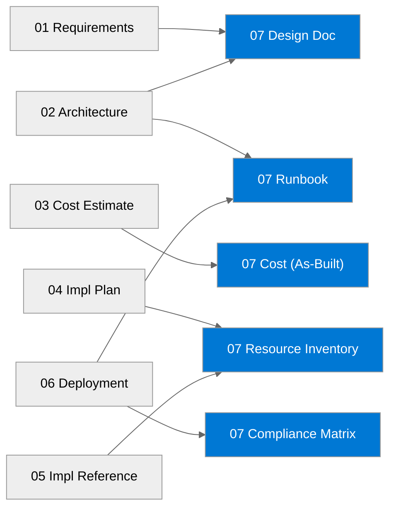

# 📚 nordic-fresh-foods - Workload Documentation

<strong>📑 Documentation Contents</strong>

- [📦 1. Document Package Contents](#-1-document-package-contents)
- [📚 2. Source Artifacts](#-2-source-artifacts)
- [📋 3. Project Summary](#-3-project-summary)
- [🔗 4. Related Resources](#-4-related-resources)
- [⚡ 5. Quick Links](#-5-quick-links)

> Generated by 08-As-Built agent | 2026-03-11

| ⬅️ Previous                                          | 📑 Index            | Next ➡️                                        |
| ---------------------------------------------------- | ------------------- | ---------------------------------------------- |
| [06-deployment-summary.md](06-deployment-summary.md) | [README](README.md) | [07-design-document.md](07-design-document.md) |

**Generated**: 2026-03-11
**Version**: 1.0
**Status**: Complete

---

## 📦 1. Document Package Contents

| Document | Description | Status |
| -------- | ----------- | ------ |
| [Design Document](./07-design-document.md) | Comprehensive architecture design |  |
| [Operations Runbook](./07-operations-runbook.md) | Day-2 operational procedures |  |
| [Resource Inventory](./07-resource-inventory.md) | Complete deployed resource listing |  |
| [Compliance Matrix](./07-compliance-matrix.md) | Security controls and compliance evidence mapping |  |
| [Backup & DR Plan](./07-backup-dr-plan.md) | Recovery and continuity procedures |  |
| [As-Built Cost Estimate](./07-ab-cost-estimate.md) | MCP-backed as-built cost model and deltas |  |

---

## 📚 2. Source Artifacts

These documents were generated from the following workflow outputs:

| Artifact | Source | Generated |
| -------- | ------ | --------- |
| Requirements | [01-requirements.md](./01-requirements.md) | 2026-03-11 |
| WAF Assessment | [02-architecture-assessment.md](./02-architecture-assessment.md) | 2026-03-11 |
| Cost Estimate (design) | [03-des-cost-estimate.md](./03-des-cost-estimate.md) | 2026-03-11 |
| Implementation Plan | [04-implementation-plan.md](./04-implementation-plan.md) | 2026-03-11 |
| Implementation Reference | [05-implementation-reference.md](./05-implementation-reference.md) | 2025-07-13 |
| Deployment Summary | [06-deployment-summary.md](./06-deployment-summary.md) | 2026-03-11 |

---

## 📋 3. Project Summary

| Attribute | Value |
| --------- | ----- |
| **Project Name** | nordic-fresh-foods |
| **Environment** | prod |
| **Primary Region** | swedencentral |
| **Compliance** | GDPR, PCI-DSS |
| **Monthly Cost (as-built estimate)** | $363.77/month |

---

## 🔗 4. Related Resources

- **Infrastructure Code**: [infra/bicep/nordic-fresh-foods/](../../infra/bicep/nordic-fresh-foods/)
- **Agent Outputs**: [agent-output/nordic-fresh-foods/](./)
- **ADRs**: [03-des-adr-0001-cost-optimized-n-tier-azure-architecture.md](./03-des-adr-0001-cost-optimized-n-tier-azure-architecture.md)

---

## ⚡ 5. Quick Links

- 📂 **Code**: [Deployment Script](../../infra/bicep/nordic-fresh-foods/deploy.ps1) | [Main Bicep Template](../../infra/bicep/nordic-fresh-foods/main.bicep)
- 📄 **Docs**: [Design Document](./07-design-document.md) | [Runbook](./07-operations-runbook.md) | [Compliance](./07-compliance-matrix.md)
- 🔗 **External**: [Azure Well-Architected Framework](https://learn.microsoft.com/azure/well-architected/) | [AVM Index](https://aka.ms/avm/index)

---

_Documentation index generated by Workload Documentation Generator._

---

| ⬅️ [06-deployment-summary.md](06-deployment-summary.md) | 🏠 [Project Index](README.md) | ➡️ [07-design-document.md](07-design-document.md) |
| ------------------------------------------------------- | ----------------------------- | ------------------------------------------------- |

