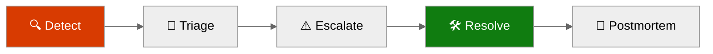
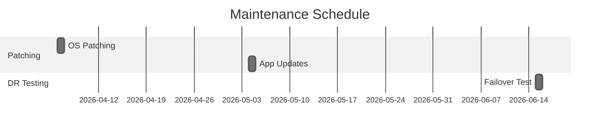
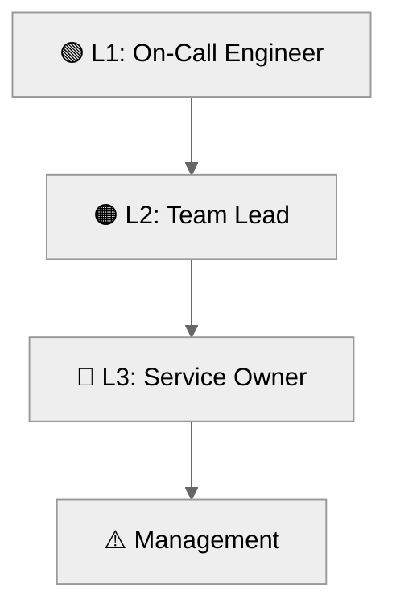

# 📖 Operations Runbook: nordic-fresh-foods


<details open>
<summary><strong>📑 Runbook Contents</strong></summary>

- [⚡ Quick Reference](#-quick-reference)
- [📋 1. Daily Operations](#-1-daily-operations)
- [🚨 2. Incident Response](#-2-incident-response)
- [🔧 3. Common Procedures](#-3-common-procedures)
- [🕐 4. Maintenance Windows](#-4-maintenance-windows)
- [📞 5. Contacts & Escalation](#-5-contacts--escalation)
- [📝 6. Change Log](#-6-change-log)
- [References](#references)

</details>

> Generated by 08-As-Built agent | 2026-03-11

| ⬅️ Previous                                    | 📑 Index            | Next ➡️                                              |
| ---------------------------------------------- | ------------------- | ---------------------------------------------------- |
| [07-design-document.md](07-design-document.md) | [README](README.md) | [07-resource-inventory.md](07-resource-inventory.md) |

**Version**: 1.0
**Date**: 2026-03-11
**Environment**: prod
**Region**: swedencentral

---

## ⚡ Quick Reference

| Item | Value |
| ---- | ----- |
| **Primary Region** | swedencentral |
| **Resource Group** | rg-nordic-fresh-foods-prod |
| **Support Contact** | technical-contact tag: sam@altman.com |
| **Escalation Path** | L1 On-call -> L2 Team Lead -> L3 Service Owner |

### Critical Resources

| Resource | Name | Resource Group | Severity |
| -------- | ---- | -------------- | -------- |
| App Service | app-nordic-fresh-foods-prod-7jrcjf | rg-nordic-fresh-foods-prod | 🔴 P1 |
| SQL Database | sqldb-freshconnect-prod | rg-nordic-fresh-foods-prod | 🔴 P1 |
| Key Vault | kv-nff-prod-7jrcjfo3iqck | rg-nordic-fresh-foods-prod | 🔴 P1 |
| Storage Account | stnffprod7jrcjfo3iqckk | rg-nordic-fresh-foods-prod | 🟠 P2 |
| Log Analytics | log-nordic-fresh-foods-prod | rg-nordic-fresh-foods-prod | 🟢 P3 |

---

## 📋 1. Daily Operations

### 1.1 Health Checks

**Morning Health Check:**

1. ✅ Verify App Service is `Running` and responding on default hostname.
2. ✅ Verify SQL server state is `Ready` and database is `Online`.
3. ✅ Verify Key Vault/Storage/SQL private endpoints remain `Approved`.

**KQL Query - System Health Overview:**

<details>
<summary><strong>📊 Health Check KQL</strong></summary>

```kusto
AppRequests
| where TimeGenerated > ago(1h)
| summarize Requests=count(), Failed=countif(Success == false), P95=percentile(DurationMs, 95)
```

</details>

### 1.2 Log Review

**Priority Logs to Review:**

| Log Source | Query Focus | Action Threshold |
| ---------- | ----------- | ---------------- |
| Application Insights | Failed requests, dependency failures | >2% failures over 15 min |
| Log Analytics | Platform warnings/errors | Any Critical/Sev0 event |
| SQL diagnostics | Connection/auth anomalies | Repeated auth/network failures |

---

## 🚨 2. Incident Response

### 2.1 Severity Definitions

| Severity | Definition | Response Time |
| -------- | ---------- | ------------- |
| 🔴 P1 | Customer-impacting outage or data-path failure | 15 minutes |
| 🟠 P2 | Major feature degradation with workaround | 1 hour |
| 🟢 P3 | Non-critical issue or maintenance defect | 1 business day |

### Incident Response Flow



### 2.2 Runbooks by Alert

| Alert | Runbook | Owner |
| ----- | ------- | ----- |
| App service unavailable | Restart app, inspect platform logs, validate VNet integration | App operations |
| SQL connectivity failures | Validate PE/DNS, test SQL endpoint, review auth | Data operations |
| Secret resolution failures | Check MI role assignment and Key Vault endpoint/health | Security operations |
| Budget threshold breach | Review cost drivers and scale settings | Platform owner |

---

## 🔧 3. Common Procedures

### 3.1 Restart Services

<details>
<summary>🔧 Restart App Service</summary>

```bash
az webapp restart \
  --resource-group rg-nordic-fresh-foods-prod \
  --name app-nordic-fresh-foods-prod-7jrcjf
```

</details>

### 3.2 Scale Resources

<details>
<summary>📈 Scale Up/Out Commands</summary>

```bash
# Manual override scale to 3 workers
az appservice plan update \
  --resource-group rg-nordic-fresh-foods-prod \
  --name asp-nordic-fresh-foods-prod \
  --number-of-workers 3
```

</details>

---

## 🕐 4. Maintenance Windows

| Task | Schedule | Duration |
| ---- | -------- | -------- |
| Platform patch + app updates | Sunday 02:00-06:00 UTC | 2-4 hours |
| DR and restore validation | Quarterly | 1 day |



> [!TIP]
> 💡 Apply changes during low-order windows and preserve rollback plan for SQL schema or config updates.

---

## 📞 5. Contacts & Escalation

| Role | Contact | Phone | On-Call Rotation |
| ---- | ------- | ----- | ---------------- |
| L1 On-call Engineer | Platform on-call | N/A | Weekly |
| L2 Team Lead | Engineering lead | N/A | Weekly |
| L3 Service Owner | Product/platform owner | N/A | Monthly |

### Escalation Path



---

## 📝 6. Change Log

| Date | Change | Author |
| ---- | ------ | ------ |
| 2026-03-11 | Initial as-built operations runbook created from deployed state | 08-As-Built agent |

---

## References

> [!NOTE]
> 📚 The following Microsoft Learn resources provide operational guidance.

| Topic | Link |
| ----- | ---- |
| Azure Monitor Alerts | [Alerting Best Practices](https://learn.microsoft.com/azure/azure-monitor/best-practices-alerts) |
| Log Analytics Queries | [KQL Reference](https://learn.microsoft.com/azure/azure-monitor/logs/get-started-queries) |
| Incident Management | [Azure Status](https://status.azure.com/) |
| Service Health | [Azure Service Health](https://learn.microsoft.com/azure/service-health/overview) |

---

_Operations runbook generated from infrastructure artifacts._

---

<div align="center">

| ⬅️ [07-design-document.md](07-design-document.md) | 🏠 [Project Index](README.md) | ➡️ [07-resource-inventory.md](07-resource-inventory.md) |
| ------------------------------------------------- | ----------------------------- | ------------------------------------------------------- |

</div>
