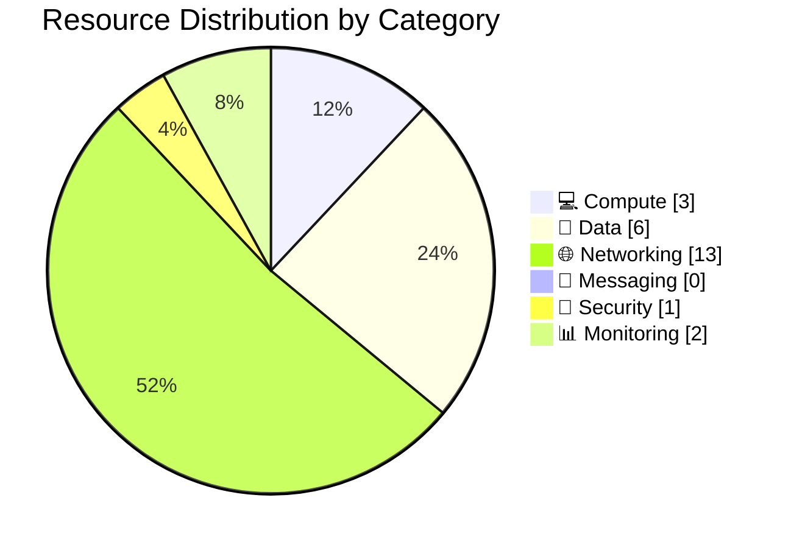

# 📦 Resource Inventory: nordic-fresh-foods

<strong>📑 Inventory Contents</strong>

- [📊 Summary](#-summary)
- [📦 Resource Listing](#-resource-listing)
- [References](#references)

> Generated by 08-As-Built agent | 2026-03-11

| ⬅️ Previous                                          | 📑 Index            | Next ➡️                                      |
| ---------------------------------------------------- | ------------------- | -------------------------------------------- |
| [07-operations-runbook.md](07-operations-runbook.md) | [README](README.md) | [07-backup-dr-plan.md](07-backup-dr-plan.md) |

**Generated**: 2026-03-11
**Source**: Azure deployed state + Bicep artifacts
**Environment**: prod
**Region**: swedencentral

---

## 📊 Summary

| Category            | Count |
| ------------------- | ----- |
| **Total Resources** | 24    |
| 💻 Compute          | 3     |
| 💾 Data Services    | 6     |
| 🌐 Networking       | 13    |
| 📨 Messaging        | 0     |
| 🔐 Security         | 1     |
| 📊 Monitoring       | 2     |

> [!NOTE]
> Resource count includes governance/ops resources (budget and autoscale), private networking artifacts (private endpoints + NICs + private DNS zones), and SQL `master` system database.

---

## 📦 Resource Listing

### 💻 Compute Resources

| Name | Type | SKU | Location | Monthly Cost | Purpose | Portal |
| ---- | ---- | --- | -------- | ------------ | ------- | ------ |
| asp-nordic-fresh-foods-prod | Microsoft.Web/serverFarms | S1 (capacity 2) | swedencentral | $146.00 | Linux App Service Plan for web/API workload | [View](https://portal.azure.com/#@/resource/subscriptions/00858ffc-dded-4f0f-8bbf-e17fff0d47d9/resourceGroups/rg-nordic-fresh-foods-prod/providers/Microsoft.Web/serverFarms/asp-nordic-fresh-foods-prod/overview) |
| app-nordic-fresh-foods-prod-7jrcjf | Microsoft.Web/sites | Standard (on S1 plan) | swedencentral | $0.00 (plan-backed) | FreshConnect application endpoint | [View](https://portal.azure.com/#@/resource/subscriptions/00858ffc-dded-4f0f-8bbf-e17fff0d47d9/resourceGroups/rg-nordic-fresh-foods-prod/providers/Microsoft.Web/sites/app-nordic-fresh-foods-prod-7jrcjf/overview) |
| autoscale-asp-nordic-fresh-foods-prod | Microsoft.Insights/autoscalesettings | N/A | swedencentral | $0.00 | Autoscale policy for App Service Plan (min 2, max 3) | [View](https://portal.azure.com/#@/resource/subscriptions/00858ffc-dded-4f0f-8bbf-e17fff0d47d9/resourceGroups/rg-nordic-fresh-foods-prod/providers/Microsoft.Insights/autoscalesettings/autoscale-asp-nordic-fresh-foods-prod/overview) |

### 💾 Data Services

| Name | Type | SKU | Configuration | Location | Monthly Cost |
| ---- | ---- | --- | ------------- | -------- | ------------ |
| sql-nordic-fresh-foods-prod | Microsoft.Sql/servers | v12.0 | Azure AD-only auth, public network disabled, TLS 1.2 | swedencentral | $0.00 |
| sqldb-freshconnect-prod | Microsoft.Sql/servers/databases | S0 (Standard, 10 DTU) | Max size 250 GB, zoneRedundant false, status Online | swedencentral | $14.71 |
| master | Microsoft.Sql/servers/databases | System | System database | swedencentral | Included |
| stnffprod7jrcjfo3iqckk | Microsoft.Storage/storageAccounts | Standard_LRS | HTTPS-only, public network disabled, no shared key auth, no public blob access | swedencentral | $1.86 (assumed 50 GB hot + txns) |
| assets | Blob container | N/A | Documented in deployment summary; data-plane read blocked by network rules | swedencentral | Included |
| product-images | Blob container | N/A | Documented in deployment summary; data-plane read blocked by network rules | swedencentral | Included |

### 🌐 Networking Resources

| Name | Type | Configuration | Location |
| ---- | ---- | ------------- | -------- |
| vnet-nordic-fresh-foods-prod | Microsoft.Network/virtualNetworks | 10.0.0.0/16 with `snet-app` (10.0.1.0/24), `snet-data` (10.0.2.0/24), `snet-pe` (10.0.3.0/24) | swedencentral |
| nsg-nordic-fresh-foods-app-prod | Microsoft.Network/networkSecurityGroups | NSG bound to `snet-app` | swedencentral |
| nsg-nordic-fresh-foods-data-prod | Microsoft.Network/networkSecurityGroups | NSG bound to `snet-data` | swedencentral |
| nsg-nordic-fresh-foods-pe-prod | Microsoft.Network/networkSecurityGroups | NSG bound to `snet-pe` | swedencentral |
| pep-sql-nordic-fresh-foods-prod-sqlServer-0 | Microsoft.Network/privateEndpoints | SQL private endpoint | swedencentral |
| pep-stnffprod7jrcjfo3iqckk-blob-0 | Microsoft.Network/privateEndpoints | Blob private endpoint | swedencentral |
| pep-kv-nff-prod-7jrcjfo3iqck-vault-0 | Microsoft.Network/privateEndpoints | Key Vault private endpoint | swedencentral |
| pep-sql-...nic... | Microsoft.Network/networkInterfaces | NIC for SQL PE | swedencentral |
| pep-st...nic... | Microsoft.Network/networkInterfaces | NIC for Blob PE | swedencentral |
| pep-kv-...nic... | Microsoft.Network/networkInterfaces | NIC for KV PE | swedencentral |
| privatelink.database.windows.net | Microsoft.Network/privateDnsZones | SQL private DNS zone with VNet link | global |
| privatelink.blob.core.windows.net | Microsoft.Network/privateDnsZones | Blob private DNS zone with VNet link | global |
| privatelink.vaultcore.azure.net | Microsoft.Network/privateDnsZones | Key Vault private DNS zone with VNet link | global |

### 📨 Messaging Resources

| Name | Type | SKU | Configuration | Location |
| ---- | ---- | --- | ------------- | -------- |
| None | N/A | N/A | Messaging services were not deployed in this workload | N/A |

### 🔐 Security Resources

| Name | Type | Configuration | Location |
| ---- | ---- | ------------- | -------- |
| kv-nff-prod-7jrcjfo3iqck | Microsoft.KeyVault/vaults | Premium, RBAC enabled, soft delete 90 days, purge protection enabled, public network disabled | swedencentral |

### 📊 Monitoring Resources

| Name | Type | Retention | Location |
| ---- | ---- | --------- | -------- |
| log-nordic-fresh-foods-prod | Microsoft.OperationalInsights/workspaces | 30 days | swedencentral |
| appi-nordic-fresh-foods-prod | Microsoft.Insights/components | 365 days | swedencentral |

### 💰 Governance Resources

| Name | Type | Configuration | Location |
| ---- | ---- | ------------- | -------- |
| budget-nordic-fresh-foods-prod | Microsoft.Consumption/budgets | USD 800 monthly budget, actual 90% + forecast 80/100/120% notifications | rg scope |

---

---

## References

| Topic | Link |
| ---- | ---- |
| Azure Resource Types | [Resource Providers](https://learn.microsoft.com/azure/azure-resource-manager/management/resource-providers-and-types) |
| Naming Conventions | [CAF Naming](https://learn.microsoft.com/azure/cloud-adoption-framework/ready/azure-best-practices/resource-naming) |
| Pricing Calculator | [Azure Pricing](https://azure.microsoft.com/pricing/calculator/) |

---

_Resource inventory generated from deployed resources and Bicep templates._

---

| ⬅️ [07-operations-runbook.md](07-operations-runbook.md) | 🏠 [Project Index](README.md) | ➡️ [07-backup-dr-plan.md](07-backup-dr-plan.md) |
| ------------------------------------------------------- | ----------------------------- | ----------------------------------------------- |

